# 02 — Architecture

> Version 2, après analyse des captures HAR. La découverte de l'API
> `get_video` (non protégée) supprime le besoin d'un navigateur piloté :
> **tout se fait en simples requêtes HTTP**, depuis n'importe quelle machine.

## 1. Principe directeur : séparer le *quoi*, le *où* et le *comment*

| Couche | Question | Source | Module |
|---|---|---|---|
| **Métadonnées** | *Quoi* télécharger ? (épisodes, IDs, durées, langue) | Site officiel (`__NEXT_DATA__`) | `official.py` |
| **Résolution** | *Où* est le fichier ? (URL signée valide) | API dramafren, puis MP4 officiel (ép. 1-10) en secours | `dramafren.py`, `pipeline.resolve_episode` |
| **Téléchargement** | *Comment* le récupérer de façon fiable ? | CDN direct (HTTP Range) | `download.py`, `mp4.py` |

La source fragile (dramafren) reste isolée dans un module. Si elle change, on
ne touche qu'à ce fichier.

## 2. Vue d'ensemble

```mermaid
flowchart LR
    IN[/"URL ou bookId"/] --> P[inputs.parse_input]
    P -->|BookRef| M[official.fetch_series<br/>dramaboxdb.com]
    M -->|Series: épisodes, durées,<br/>bookId de la langue| R[resolve_episode]
    M -. 404 .-> PR[probe_series<br/>via dramafren]
    PR --> R
    R --> R1[dramafren.get_video<br/>540p / 720p / 1080p]
    R --> R2[MP4 officiel<br/>ép. 1-10, 720p]
    R1 & R2 --> V[cdn.matches_episode<br/>chemin = bon épisode ?]
    V --> D[download<br/>Range, .part par variante]
    D --> C[check_duration<br/>mvhd = durée officielle ±1 s]
    C --> S[(downloads/…/E001.mp4<br/>manifest.json)]
    S -. option --film .-> F[film.build_film<br/>ffmpeg concat sans ré-encodage<br/>+ chapitres]
    F --> FM[(Titre.mp4)]
```



## 3. Composants

### 3.1 `inputs.py`
`parse_input(texte) -> BookRef(book_id, lang)`. Formats acceptés : URL
officielle (série ou épisode, avec ou sans locale), `dramabox.com/drama/…`,
lien de partage `dramaboxapp.com`, URL dramafren (le `lang` y est ignoré, car
il ne change pas la vidéo), paramètre `bookId=` ou identifiant brut. Seule la
locale d'une URL officielle (`/fr/movie/…`) est retenue comme langue.

### 3.2 `official.py`
1. `GET https://www.dramaboxdb.com/{locale}/movie/{bookId}/` (redirige vers le
   bon slug ; pas de préfixe pour `en`).
2. Parse de `__NEXT_DATA__` → `pageProps` (le HTML est plus stable que
   `/_next/data/{buildId}/…`, dont le `buildId` change à chaque déploiement).
3. `Series` :
   - titre ;
   - `source_book_id` (livre de la langue choisie) ;
   - langues disponibles ;
   - pour chaque `Episode` : `chapter_id` (ID d'origine), `media_id` (ID
     réellement présent dans les chemins CDN, lu dans l'URL de la cover),
     `duration_ms`, `free_url`.
4. `404` ou page sans `bookInfo` → `SeriesNotFound`. Le pipeline bascule alors
   en **mode sonde** : il interroge dramafren épisode par épisode jusqu'au
   premier `ok: false`, sans contrôle de durée.

### 3.3 `dramafren.py`
`get_video(book_id, ep)` → `[VideoSource]`, meilleure qualité d'abord.
- Endpoint principal `cdn-dramabox…`, puis secours `cdn-dramaboxv2…` (comme
  le site).
- En-têtes `Origin`/`Referer` identiques au navigateur. Aucun cookie.
- `lang=en` et `sv=1` sont fixes (voir [étude §2.2](01-etude-technique.md#22-lapi-vidéo-trouvée-grâce-aux-captures-har-)).
- Les appels sont **espacés de 0,3 s** (`RateLimiter`), même avec plusieurs
  téléchargements en parallèle.

### 3.4 `cdn.py`
- `expected_path(book_id, media_id)` : formule déterministe
  ([étude §4](01-etude-technique.md#4-le-chemin-cdn-est-déterministe-)).
- `matches_episode(url, …)` : **toute URL qui ne pointe pas vers le bon
  épisode est écartée** (protection contre les inversions d'épisodes).
- `expires_at(url)` : jeton Akamai (segment hexadécimal) ou CloudFront
  (`Expires`), conservé dans le manifest.

### 3.5 `download.py` + `mp4.py`
- Écriture dans `E028.<variante>.part` (ex.
  `E028.577159363.1080p.nav2.mp4.part`). Un `.part` par variante, pour ne
  jamais reprendre un fichier 1080p avec les octets d'un 720p.
- Reprise par `Range: bytes=N-` ; `200` au lieu de `206` → on repart de zéro ;
  `416` → `.part` obsolète supprimé.
- `401/403/404/410` → `UrlRejected` : le pipeline passe à la source
  suivante, puis re-résout.
- Contrôles, **sans ffmpeg** :
  - la taille reçue doit valoir `Content-Length` (ou le total de
    `Content-Range`) ;
  - la durée `mvhd` du MP4 doit égaler la durée officielle à ±1 s.
- Renommage atomique `.part` → `E028.mp4`, puis nettoyage des autres `.part`
  de l'épisode.

### 3.6 `pipeline.py`
Pour chaque épisode, dans un pool de *N* threads (3 par défaut) :

```
fichier E0xx.mp4 présent et durée OK ?  → « déjà présent »
sinon, jusqu'à 3 tentatives :
    sources = dramafren (filtrées par cdn.matches_episode) + MP4 officiel si gratuit
    pour chaque source (qualité demandée d'abord, puis les autres) :
        téléchargement → OK : status=done, fin
        URL refusée / fichier incorrect → source suivante
        erreur réseau → pause (2 s, 4 s) puis nouvelle résolution
→ status=failed + message, sans bloquer les autres épisodes
```

### 3.7 `manifest.py`
`downloads/{bookId}-{slug}[-{lang}]/manifest.json`, réécrit atomiquement à
chaque changement d'état :

```jsonc
{
  "platform": "dramabox", "book_id": "41000105199", "source_book_id": "41000111625",
  "lang": "fr", "title": "Qui Est la Véritable Mme Lafont ?", "episode_count": 62,
  "episodes": [
    { "number": 28, "chapter_id": "577159363", "media_id": "586357960", "duration_ms": 79134,
      "status": "done", "quality": "1080p", "origin": "dramafren",
      "url": "https://hwztakavideoto…", "url_expires_at": "2026-10-19T06:27:45+00:00",
      "file": "E028.mp4", "bytes": 10149996 }
  ]
}
```

Le traitement est idempotent : relancer la même commande ne fait que ce qui
manque, ou ce qui a échoué.

### 3.8 `cli.py`

```bash
sdg info  <url> [--lang fr]
sdg fetch <url> [--lang fr] [-q best|1080p|720p|540p] [-e 1-10,28,40-] [-o downloads] [-j 3] [--film]
sdg links <url> [--lang fr] [-q ...] [-e ...] [--json]   # URLs pour aria2c / IDM
sdg film  <dossier|url|id> [--lang fr] [-f film.mp4] [--reencode] [--allow-missing] [--no-chapters] [--ffmpeg PATH]
```

### 3.9 `film.py` : fusion en un seul film

ffmpeg est trouvé dans cet ordre : `--ffmpeg`, le `PATH`, puis le paquet
optionnel `imageio-ffmpeg`. Avec `fetch --film`, il est cherché **avant** le
téléchargement, pour échouer tout de suite s'il manque.

1. **`plan_film`** : liste les `E###.mp4` du manifest et analyse chacun avec
   `mp4.probe` (Python pur). Refuse s'il manque des épisodes, sauf avec
   `--allow-missing`.
2. **Compatibilité** : les épisodes sont regroupés par `format_key`, c'est-à-dire :
   - codec + résolution + `avcC` (SPS/PPS) ;
   - codec audio + fréquence + canaux + `AudioSpecificConfig`.

   Les champs de débit de l'`esds`, qui varient d'un épisode à l'autre, sont
   ignorés : ils n'ont aucun effet sur le décodage. Mesuré sur la série de
   test : `avcC` identique octet pour octet au sein d'une qualité, différent
   entre 720p et 1080p.
3. **Un seul groupe → copie** : `ffmpeg -f concat -c copy -movflags +faststart`.
   62 épisodes en ~6 s, sans perte.
4. **Plusieurs groupes → refus explicite**, ou `--reencode` : filtre
   `concat` avec mise à l'échelle et bandes noires vers le format majoritaire
   (en durée), libx264 `veryfast` CRF 20 + AAC 128k. Le graphe passe en ligne
   de commande, ou dans un fichier au-delà de 30 000 caractères (limite
   Windows).
5. **Chapitres** : fichier FFMETADATA, un chapitre « Épisode N » par épisode.
6. **Contrôle** : durée du film = somme attendue (tolérance 1 s + 0,05 s par
   épisode), puis renommage atomique `.part` → `Titre.mp4`, et entrée `film`
   dans le manifest.

**Piège évité : les edit lists.** Chaque épisode DramaBox contient des
paquets audio de *priming* AAC (~0,115 s) placés avant la vidéo, et masqués
par une edit list. Deux durées coexistent donc :
- `mvhd` = 153,118 s : l'étendue complète du fichier ;
- présentation = 153,003 s : ce que montre un lecteur.

Sans précaution, le démuxeur `concat` enchaîne les fichiers sur la durée de
présentation. Deux conséquences :
- le priming de l'épisode N+1 **chevauche** la fin de l'audio de l'épisode N
  (timestamps tassés) ;
- des chapitres calculés sur `mvhd` dérivent de 0,115 s par épisode, soit
  **6,9 s** au 62ᵉ (mesuré).

La correction :
- chaque fichier de la liste reçoit une directive `duration` = `mvhd` : pas
  de chevauchement ;
- les chapitres utilisent exactement ces durées.

Résultat mesuré sur 62 épisodes :
- décalage audio/vidéo identique aux fichiers d'origine à 0,7 ms près ;
- aucune dérive ;
- aucun avertissement ffmpeg ;
- chaque chapitre commence un instant (0,114 s) avant la première image de son
  épisode.

En mode `--reencode`, ffmpeg applique les edit lists au décodage, donc les
chapitres utilisent la durée de présentation (lue dans `elst` par `mp4.probe`).

Codes de sortie : `0` = tout OK, `1` = au moins un échec (relancer pour
réessayer), `2` = entrée invalide, `130` = interrompu (Ctrl+C, reprise
possible).

## 4. Séquence d'un `sdg fetch`

```mermaid
sequenceDiagram
    actor U as Utilisateur
    participant CLI as sdg fetch
    participant Off as dramaboxdb.com
    participant DF as API dramafren
    participant CDN as CDN Akamai
    U->>CLI: sdg fetch <url> --lang fr
    CLI->>Off: GET /fr/movie/41000105199/
    Off-->>CLI: 62 épisodes, durées, sourceBookId=41000111625
    par 3 workers
        CLI->>DF: get_video id=41000111625 ep=N (espacés de 0,3 s)
        DF-->>CLI: URLs 1080p / 720p / 540p
        CLI->>CLI: chemin == épisode N ?
        CLI->>CDN: GET (Range si .part)
        CDN-->>CLI: MP4
        CLI->>CLI: durée mvhd == durée officielle ?
    end
    CLI-->>U: 62/62 OK
```

## 5. Choix techniques

| Besoin | Choix | Pourquoi |
|---|---|---|
| Langage | Python ≥ 3.10 | Simple, multiplateforme, bon pour la suite vidéo |
| Dépendances | **Aucune** (bibliothèque standard) | `python -m shortdramagen` marche sans `pip install`, y compris sous Windows |
| HTTP | `urllib` derrière une petite classe `Http` | Proxy et CA système gérés ; remplaçable par un faux dans les tests |
| Parallélisme | `ThreadPoolExecutor` | Téléchargements limités par le réseau, pas par le CPU |
| Contrôle vidéo | Lecture des boîtes MP4 (`mvhd`, `stsd`, `elst`) en Python pur | Pas besoin de ffmpeg pour télécharger ni pour vérifier |
| Fusion | ffmpeg (PATH, `--ffmpeg` ou `pip install imageio-ffmpeg`) | Seul outil fiable pour remuxer ; optionnel |
| Tests | `unittest` + fixtures JSON anonymisées + faux réseau + MP4 synthétiques | Hors ligne, < 1 s ; tests ffmpeg réels ignorés s'il est absent |

Ce qui avait été envisagé en V1 (httpx, typer, Playwright) n'est plus
nécessaire. Le navigateur piloté reste un **plan B** documenté, si dramafren
venait à protéger son API (voir [03](03-brainstorm-et-roadmap.md)).

## 6. Arborescence

```
shortdramagen/
├── __main__.py      # python -m shortdramagen
├── cli.py           # sous-commandes info / fetch / links
├── models.py        # BookRef, Series, Episode, VideoSource
├── inputs.py        # URL -> BookRef
├── official.py      # métadonnées dramaboxdb.com
├── dramafren.py     # API get_video
├── cdn.py           # formule de chemin, expiration
├── http.py          # client urllib (retries sur erreurs réseau et 5xx)
├── download.py      # téléchargement reprenable + contrôles
├── mp4.py           # durée, codecs, edit lists d'un MP4 (sans ffmpeg)
├── film.py          # fusion en un seul film (ffmpeg) + chapitres
├── manifest.py      # état par série
└── pipeline.py      # orchestration
tests/
├── fakes.py         # FakeHttp, générateur de MP4 (pistes, avcC, esds, edit lists)
├── fixtures/        # extraits réels anonymisés (site officiel EN/FR, réponse get_video)
└── test_*.py
```

## 7. Extensibilité multi-plateformes

dramafren expose le même schéma pour d'autres plateformes (sous-domaines
`dramapops.`, `reelshort.`…). Il est probable que chacune ait son
`cdn-<plateforme>.dramafren.org/index.php?action=get_video`, mais ce n'est
pas vérifié. Pour en ajouter une, il faudrait :
- un module de métadonnées (ou le mode sonde si aucun site officiel n'est
  exploitable) ;
- l'endpoint dramafren correspondant ;
- la règle de validation d'URL propre à son CDN.

`download`, `manifest`, `mp4` et la CLI restent partagés.
