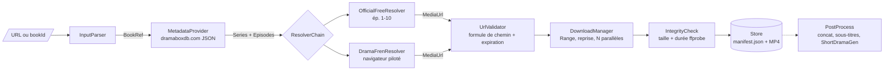
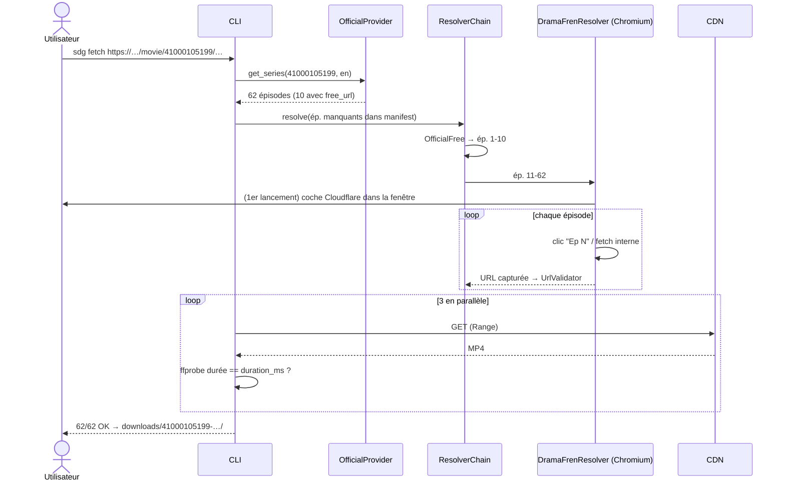

# 02 — Architecture

## 1. Principe directeur : séparer le *quoi*, le *où* et le *comment*

| Couche | Question | Source | Stabilité |
|---|---|---|---|
| **Métadonnées** | *Quoi* télécharger ? (épisodes, IDs, durées) | Site officiel (JSON Next.js) | Haute |
| **Résolution** | *Où* est le fichier ? (URL signée valide) | Plugins : officiel (ép. 1-10), dramafren (tous) | **Faible** (Cloudflare, changements de site) |
| **Téléchargement** | *Comment* le récupérer de façon fiable ? | CDN direct (HTTP Range) | Haute |

La partie fragile, dramafren, est **isolée derrière une interface** : si le site
change ou disparaît, on remplace un plugin sans toucher au reste.

## 2. Vue d'ensemble



## 3. Composants

### 3.1 `InputParser`
Normalise n'importe quelle entrée en `BookRef(platform, book_id, lang)` :
URL officielle (série ou épisode, avec ou sans locale), `dramabox.com/drama/…`,
lien de partage de l'app, URL dramafren, ou `bookId` brut. Pure fonction avec
tests unitaires sur chaque format.

### 3.2 `MetadataProvider` — `DramaBoxOfficialProvider`
1. `GET https://www.dramaboxdb.com/{locale}/movie/{bookId}/` (redirige vers le
   bon slug) et parse de `__NEXT_DATA__`.
2. Variante plus légère : `GET /_next/data/{buildId}/{locale}/movie/{bookId}/{slug}.json`,
   avec repli sur le HTML si `buildId` a changé (404).
3. Produit `Series` (titre, synopsis, cover, tags, langue, `source_book_id`)
   et la liste complète des `Episode` (`chapter_id`, `index`, `duration_ms`,
   `cover`, `free_url` si `unlock`).

Sans navigateur ni Cloudflare, en une seule requête. **Le nombre d'épisodes
officiel sert de référence** pour vérifier qu'on n'en oublie aucun.

### 3.3 `Resolver` (interface + chaîne)

```python
class Resolver(Protocol):
    name: str
    def supports(self, series: Series) -> bool: ...
    async def resolve(self, series: Series, episodes: list[Episode]) -> dict[str, MediaUrl]: ...
```

La `ResolverChain` essaie les resolvers dans l'ordre et ne passe au suivant que
pour les épisodes encore non résolus.

| Resolver | Couvre | Mécanisme | Expiration URL |
|---|---|---|---|
| `OfficialFreeResolver` | ép. 1-10 | `chapterList[].mp4`, déjà dans les métadonnées | ~24 h |
| `DramaFrenResolver` | tous | Navigateur piloté (voir 3.4) | ~3 semaines |
| `ManualListResolver` | tous | Fichier JSON/TXT d'URLs fourni (userscript, copier-coller) | variable |

### 3.4 `DramaFrenResolver` : la pièce délicate

Contrainte : Cloudflare Turnstile interactif. **On ne cherche pas à le
contourner** : on réutilise une session humaine légitime. Trois modes sont
possibles, du plus automatique au plus manuel :

**Mode A — Profil Playwright persistant (recommandé pour démarrer)**
- `chromium.launch_persistent_context(user_data_dir=".profile/dramafren", headless=False)`.
- Au premier lancement, la fenêtre s'ouvre et tu coches la case Cloudflare une
  fois. Le cookie `cf_clearance` est conservé dans le profil (lié à l'IP et au
  User-Agent).
- Le resolver ouvre la page détail puis, pour chaque épisode :
  - **Stratégie générique (V1)** : clic sur « Ep N » et interception réseau
    `page.on("response")` des URLs `dramaboxdb.com/…\.(mp4|m3u8)`. Elle ne
    dépend pas du DOM exact et correspond à ce que tu fais dans DevTools.
  - **Stratégie optimisée (V2)** : une fois l'endpoint interne identifié via
    le HAR, appel direct depuis le contexte de la page
    (`page.evaluate(fetch(...))`), avec les mêmes cookies et la même origine.
    C'est plus rapide et on n'a pas besoin de lancer la lecture.
- Chaque URL capturée passe par l'`UrlValidator` (bon `chapterId` et bon
  `bookId` inversé dans le chemin). Sinon, on la rejette et on réessaie.

**Mode B — Attacher ton vrai Chrome (CDP)**
- Tu lances Chrome avec `--remote-debugging-port=9222 --user-data-dir=…`, puis
  `chromium.connect_over_cdp("http://localhost:9222")`.
- L'empreinte est 100 % humaine, avec la même logique que le mode A.

**Mode C — Userscript / bookmarklet (repli sans automatisation)**
- Un script (Tampermonkey ou bookmarklet) exécuté sur la page détail dramafren
  parcourt les épisodes en `fetch` même-origine et exporte un `links.json`.
- Ensuite : `sdg download links.json`, via le `ManualListResolver`.
- Aucun risque de détection de bot, mais une action manuelle par série.

> Toutes ces options supposent que l'outil tourne **sur ta machine** (IP
> résidentielle). Sur un serveur ou dans le cloud, dramafren bloquera (vérifié).

**Politesse** : 1 épisode à la fois côté dramafren, pause aléatoire de 1 à 3 s,
cache des URLs déjà résolues (valables environ 3 semaines).

### 3.5 `UrlValidator` / `cdn.py`
- `expected_path(book_id, chapter_id)` : formule déterministe
  ([étude §4](01-etude-technique.md#4-le-chemin-cdn-est-déterministe-)).
- `expires_at(url)` gère deux cas :
  - Akamai : second segment hexadécimal du chemin.
  - CloudFront : paramètre `Expires`.
- `is_valid_for(url, episode)` : chemin conforme et non expiré (marge de 10
  min).

### 3.6 `DownloadManager`
- Client `httpx` asynchrone, **3 téléchargements en parallèle** par défaut
  (paramétrable).
- Écriture dans `E028.mp4.part`, reprise via `Range: bytes={taille}-`, puis
  renommage atomique.
- Retries avec backoff exponentiel. Sur `403` ou URL expirée : **re-résolution
  automatique** de l'épisode puis nouvelle tentative.
- MP4 : téléchargement direct. HLS : `ffmpeg -i playlist.m3u8 -c copy`, en
  secours seulement.

### 3.7 `IntegrityCheck`
- La taille reçue doit être égale à `Content-Length`.
- `ffprobe` : durée à ±0,5 s de `duration_ms` et flux vidéo lisible.
- En cas d'échec, suppression du fichier et nouvelle tentative (max 3), puis
  statut `failed` dans le manifest.

### 3.8 `Store` : manifest et arborescence

```
downloads/
└── 41000105199-one-night-to-forever/
    ├── manifest.json
    ├── cover.jpg
    ├── E001.mp4
    ├── …
    └── E062.mp4
```

```jsonc
// manifest.json
{
  "platform": "dramabox",
  "book_id": "41000105199",
  "title": "One Night to Forever",
  "lang": "en",
  "episode_count": 62,
  "created_at": "2026-09-26T19:30:00Z",
  "episodes": [
    { "index": 28, "chapter_id": "577159363", "duration_ms": 79134,
      "status": "done",            // pending | resolved | downloading | done | failed
      "resolver": "dramafren",
      "url_expires_at": "2026-10-19T06:27:45Z",
      "file": "E028.mp4", "bytes": 6902326 }
  ]
}
```

Le traitement est **idempotent** : relancer la commande saute les épisodes
`done` et reprend les autres. Les URLs signées ne sont pas des secrets, mais
elles expirent ; on les garde pour le debug.

### 3.9 CLI

```bash
sdg info    <url>                         # métadonnées + nombre d'épisodes, aucun téléchargement
sdg fetch   <url> [--lang en] [--episodes 1-20,35] [--out downloads/] [--jobs 3]
            [--resolver auto|official|dramafren|manual] [--browser playwright|cdp]
sdg resolve <url> --export links.json     # résout seulement (utilisable avec aria2c, IDM…)
sdg download links.json                   # télécharge une liste déjà résolue
sdg verify  downloads/41000105199-…/      # recontrôle l'intégrité
sdg concat  downloads/41000105199-…/      # (option) un seul fichier « film »
```

## 4. Séquence d'un `sdg fetch`



## 5. Stack technique proposée

| Besoin | Choix | Pourquoi |
|---|---|---|
| Langage | **Python 3.12** | Écosystème vidéo et IA (ffmpeg, Whisper, montage) pour la suite « Gen » |
| HTTP | `httpx` (async, HTTP/2) | Range, streaming, timeouts fins |
| Navigateur | `playwright` (Python) | Profil persistant, interception réseau, CDP |
| Modèles | `pydantic` v2 | Validation des JSON officiels et du manifest |
| CLI | `typer` + `rich` | Sous-commandes, barres de progression |
| Vidéo | `ffmpeg` / `ffprobe` | Contrôle de durée, HLS, concaténation |
| Tests | `pytest` + fixtures JSON/HAR enregistrées | Tests hors-ligne ; détection des changements de site |

Alternative crédible : TypeScript/Node (Playwright y est natif). Elle
compliquerait la partie traitement vidéo et IA prévue ensuite.

## 6. Arborescence du code (cible)

```
shortdramagen/
├── cli.py
├── models.py              # BookRef, Series, Episode, MediaUrl, Manifest
├── inputs.py              # InputParser
├── cdn.py                 # formule de chemin, expiration, validation
├── providers/
│   └── dramabox_official.py
├── resolvers/
│   ├── base.py            # Protocol + ResolverChain
│   ├── official_free.py
│   ├── dramafren.py       # modes playwright / cdp
│   └── manual_list.py
├── download/
│   ├── manager.py
│   └── integrity.py
├── store/manifest.py
└── postprocess/ffmpeg.py
tests/
├── fixtures/              # __NEXT_DATA__ enregistré, HAR dramafren nettoyé
└── test_*.py
userscripts/
└── dramafren-export.user.js   # mode C
```

## 7. Extensibilité multi-plateformes

`platform` est une dimension de premier niveau (`BookRef.platform`). Chaque
plateforme (ReelShort, GoodShort, ShortMax…) apporte :
- son `MetadataProvider` (site officiel, s'il en existe un exploitable),
- sa fonction `cdn` (validation d'URL),
- sa configuration de resolver dramafren (sous-domaine, sélecteurs, endpoint).

Download, store, intégrité et CLI sont partagés.
