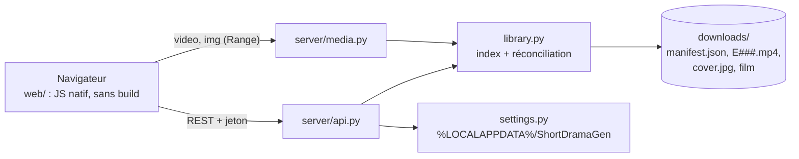

# 02 — Architecture

> Version 2, après analyse des captures HAR. La découverte de l'API
> `get_video` (non protégée) supprime le besoin d'un navigateur piloté :
> **tout se fait en simples requêtes HTTP**, depuis n'importe quelle machine.

## 1. Principe directeur : séparer le *quoi*, le *où* et le *comment*

| Couche | Question | Source | Module |
|---|---|---|---|
| **Métadonnées** | *Quoi* télécharger ? (épisodes, IDs, durées, langue) | Site officiel (`__NEXT_DATA__`) | `official.py` |
| **Résolution** | *Où* est le fichier ? (URL signée valide) | API dramafren, puis MP4 officiel (ép. 1-10) en secours | `dramafren.py`, `pipeline.resolve_episode` |
| **Téléchargement** | *Comment* le récupérer de façon fiable ? | CDN direct (HTTP Range) | `download.py`, `mp4.py` |

La source fragile (dramafren) reste isolée dans un module. Si elle change, on
ne touche qu'à ce fichier.

## 2. Vue d'ensemble

```mermaid
flowchart LR
    IN[/"URL ou bookId"/] --> P[inputs.parse_input]
    P -->|BookRef| M[official.fetch_series<br/>dramaboxdb.com]
    M -->|Series: épisodes, durées,<br/>bookId de la langue| R[resolve_episode]
    M -. 404 .-> PR[probe_series<br/>via dramafren]
    PR --> R
    R --> R1[dramafren.get_video<br/>540p / 720p / 1080p]
    R --> R2[MP4 officiel<br/>ép. 1-10, 720p]
    R1 & R2 --> V[cdn.matches_episode<br/>chemin = bon épisode ?]
    V --> D[download<br/>Range, .part par variante]
    D --> C[check_duration<br/>mvhd = durée officielle ±1 s]
    C --> S[(downloads/…/E001.mp4<br/>manifest.json)]
    S -. option --film .-> F[film.build_film<br/>ffmpeg concat sans ré-encodage<br/>+ chapitres]
    F --> FM[(Titre.mp4)]
```



## 3. Composants

### 3.1 `inputs.py`
`parse_input(texte) -> BookRef(book_id, lang)`. Formats acceptés : URL
officielle (série ou épisode, avec ou sans locale), `dramabox.com/drama/…`,
lien de partage `dramaboxapp.com`, URL dramafren (le `lang` y est ignoré, car
il ne change pas la vidéo), paramètre `bookId=` ou identifiant brut. Seule la
locale d'une URL officielle (`/fr/movie/…`) est retenue comme langue.
`BookRef.episode` garde l'épisode visé par un lien d'épisode (`/ep/…_Episode-28`
ou `ep=28` chez dramafren), pour que l'interface puisse le mettre en avant.

`parse_episodes("1-10, 28, 50-")` → `[(1, 10), (28, 28), (50, None)]` vit
aussi ici (et plus dans la CLI) : espaces, tirets typographiques et signe
moins sont tolérés, une plage invalide lève `InputError`.

### 3.2 `official.py`
1. `GET https://www.dramaboxdb.com/{locale}/movie/{bookId}/` (redirige vers le
   bon slug ; pas de préfixe pour `en`).
2. Parse de `__NEXT_DATA__` → `pageProps` (le HTML est plus stable que
   `/_next/data/{buildId}/…`, dont le `buildId` change à chaque déploiement).
3. `Series` :
   - titre, et titre VO (`title_vo`, tiré de `bookNameEn`) ;
   - `source_book_id` (livre de la langue choisie) ;
   - langues disponibles, et langue réelle de la version obtenue (lue dans
     `bookInfo.language` : une page `/de/` d'une série sans doublage allemand
     renvoie la VO, étiquetée `en` et non `de`) ;
   - pour chaque `Episode` : `chapter_id` (ID d'origine), `media_id` (ID
     réellement présent dans les chemins CDN, lu dans l'URL de la cover),
     `duration_ms`, `free_url`.
4. `download_cover(url, dest)` enregistre l'affiche (JPEG 540×720, contrôlé
   par sa signature) en `cover.jpg` à côté des épisodes.
5. `404` ou page sans `bookInfo` → `SeriesNotFound`. Le pipeline bascule alors
   en **mode sonde** : il interroge dramafren épisode par épisode jusqu'au
   premier `ok: false`, sans contrôle de durée.

### 3.3 `dramafren.py`
`get_video(book_id, ep)` → `[VideoSource]`, meilleure qualité d'abord.
- Endpoint principal `cdn-dramabox…`, puis secours `cdn-dramaboxv2…` (comme
  le site).
- En-têtes `Origin`/`Referer` identiques au navigateur. Aucun cookie.
- `lang=en` et `sv=1` sont fixes (voir [étude §2.2](01-etude-technique.md#22-lapi-vidéo-trouvée-grâce-aux-captures-har-)).
- Les appels sont **espacés de 0,3 s** (`RateLimiter`), même avec plusieurs
  téléchargements en parallèle.

### 3.4 `cdn.py`
- `expected_path(book_id, media_id)` : formule déterministe
  ([étude §4](01-etude-technique.md#4-le-chemin-cdn-est-déterministe-)).
- `matches_episode(url, …)` : **toute URL qui ne pointe pas vers le bon
  épisode est écartée** (protection contre les inversions d'épisodes).
- `expires_at(url)` : jeton Akamai (segment hexadécimal) ou CloudFront
  (`Expires`), conservé dans le manifest.

### 3.5 `download.py` + `mp4.py`
- Écriture dans `E028.<variante>.part` (ex.
  `E028.577159363.1080p.nav2.mp4.part`). Un `.part` par variante, pour ne
  jamais reprendre un fichier 1080p avec les octets d'un 720p.
- Reprise par `Range: bytes=N-` ; `200` au lieu de `206` → on repart de zéro ;
  `416` → `.part` obsolète supprimé.
- `401/403/404/410` → `UrlRejected` : le pipeline passe à la source
  suivante, puis re-résout.
- Contrôles, **sans ffmpeg** :
  - la taille reçue doit valoir `Content-Length` (ou le total de
    `Content-Range`) ;
  - la durée `mvhd` du MP4 doit égaler la durée officielle à ±1 s.
- Renommage atomique `.part` → `E028.mp4`, puis nettoyage des autres `.part`
  de l'épisode.

### 3.6 `pipeline.py`
Pour chaque épisode, dans un pool de *N* threads (3 par défaut) :

```
fichier E0xx.mp4 présent et durée OK ?  → « déjà présent »
sinon, jusqu'à 3 tentatives :
    sources = dramafren (filtrées par cdn.matches_episode) + MP4 officiel si gratuit
    pour chaque source (qualité demandée d'abord, puis les autres) :
        téléchargement → OK : status=done, fin
        URL refusée / fichier incorrect → source suivante
        erreur réseau → pause (2 s, 4 s) puis nouvelle résolution
→ status=failed + message + error_code, sans bloquer les autres épisodes
```

Le pipeline se pilote de l'extérieur (arrêt, événements, options) : voir
[§3.10](#310-moteur-pilotable--fetchcontrol-événements-codes-derreur).

### 3.7 `manifest.py`
`downloads/{bookId}-{slug}[-{lang}]/manifest.json`, réécrit atomiquement à
chaque changement d'état :

```jsonc
{
  "schema_version": 2,
  "platform": "dramabox", "book_id": "41000105199", "source_book_id": "41000111625",
  "lang": "fr", "title": "Qui Est la Véritable Mme Lafont ?", "title_vo": "One Night to Forever",
  "languages": ["en", "fr", "es"], "from_official": true,
  "episode_count": 62, "total_duration_ms": 5520000,
  "cover_file": "cover.jpg",
  "created_at": "2026-09-27T08:12:03+00:00", "updated_at": "2026-09-27T08:19:40+00:00",
  "requested": { "lang": "fr", "quality": "best", "episodes": null, "at": "2026-09-27T08:12:03+00:00" },
  "episodes": [
    { "number": 28, "chapter_id": "577159363", "media_id": "586357960", "duration_ms": 79134,
      "status": "done", "quality": "1080p", "origin": "dramafren",
      "url": "https://hwztakavideoto…", "url_expires_at": "2026-10-19T06:27:45+00:00",
      "file": "E028.mp4", "bytes": 10149996, "attempts": 1, "finished_at": "2026-09-27T08:14:51+00:00" },
    { "number": 40, "status": "failed", "error_code": "ep_unavailable",
      "error": "Épisode 40 indisponible sur dramafren (…)", "attempts": 1 }
  ],
  "film": { "file": "Qui Est la Véritable Mme Lafont.mp4", "episodes": [1, 2, "…"], "missing": [],
            "mode": "copy", "duration_s": 5520.4, "bytes": 717000000, "chapters": 62,
            "created_at": "2026-09-27T08:20:02+00:00" }
}
```

Le traitement est idempotent : relancer la même commande ne fait que ce qui
manque, ou ce qui a échoué.

Version 2 du schéma (étape 0 du frontend) :
- **champs ajoutés** : `title_vo`, `languages`, `from_official`,
  `total_duration_ms`, `cover_file`, `created_at`, `requested` ; par épisode
  `error_code`, `attempts`, `finished_at`, et `quality_requested` quand la
  qualité obtenue n'est pas celle demandée ;
- **cohérence** : repasser en `downloading`, `pending` ou `done` efface
  l'ancienne erreur ; à l'ouverture, un épisode resté en `downloading`
  (arrêt brutal) repasse en `pending` ;
- **manifest illisible** : mis de côté en `manifest.corrupt-<date>.json` puis
  reconstruit (les fichiers présents sont retrouvés par leur vérification) ;
  en lecture seule, `ManifestError` donne un message clair au lieu d'une trace ;
- **écouteur** : `Manifest(listener=…)` est appelé après chaque sauvegarde
  avec le numéro d'épisode modifié (ou `None`), hors du verrou. C'est ce que
  le serveur relaiera en SSE ;
- les manifests v1 restent lisibles et passent en v2 au prochain `fetch`.

### 3.8 `cli.py`

```bash
sdg info  <url> [--lang fr]                              # aperçu : aucune écriture, aucune sonde
sdg fetch <url> [--lang fr] [-q best|1080p|720p|540p] [-e 1-10,28,40-] [-o downloads] [-j 3]
                [--film [--reencode] [--allow-missing] [--no-chapters] [--replace] [--ffmpeg PATH]]
sdg links <url> [--lang fr] [-q ...] [-e ...] [--json]   # URLs pour aria2c / IDM
sdg film  <dossier|url|id> [--lang fr] [-f film.mp4] [--reencode] [--allow-missing] [--no-chapters] [--replace] [--ffmpeg PATH]
sdg ui    [-o dossier] [--port 8765] [--no-browser] [--window]   # interface web locale (§3.11)
```

La CLI n'est qu'un client du moteur : `info` appelle `preview_series`, `fetch`
appelle `pipeline.fetch`, `film` et `fetch --film` appellent `film.make_film`.
Avec `fetch --film`, le film n'est pas créé si des épisodes ont échoué, sauf
avec `--allow-missing` ; il n'est pas créé non plus après un arrêt pour disque
plein. Les erreurs réseau, disque ou de manifest s'affichent en une ligne
lisible (code de sortie 1), sans trace Python.

### 3.9 `film.py` : fusion en un seul film

ffmpeg est trouvé dans cet ordre : `--ffmpeg`, le `PATH`, puis le paquet
optionnel `imageio-ffmpeg`. Avec `fetch --film`, il est cherché **avant** le
téléchargement, pour échouer tout de suite s'il manque.

1. **`plan_film`** : liste les `E###.mp4` du manifest et analyse chacun avec
   `mp4.probe` (Python pur). Refuse s'il manque des épisodes, sauf avec
   `--allow-missing`.
2. **Compatibilité** : les épisodes sont regroupés par `format_key`, c'est-à-dire :
   - codec + résolution + `avcC` (SPS/PPS) ;
   - codec audio + fréquence + canaux + `AudioSpecificConfig`.

   Les champs de débit de l'`esds`, qui varient d'un épisode à l'autre, sont
   ignorés : ils n'ont aucun effet sur le décodage. Mesuré sur la série de
   test : `avcC` identique octet pour octet au sein d'une qualité, différent
   entre 720p et 1080p.
3. **Un seul groupe → copie** : `ffmpeg -f concat -c copy -movflags +faststart`.
   62 épisodes en ~6 s, sans perte.
4. **Plusieurs groupes → refus explicite**, ou `--reencode` : filtre
   `concat` avec mise à l'échelle et bandes noires vers le format majoritaire
   (en durée), libx264 `veryfast` CRF 20 + AAC 128k. Le graphe passe en ligne
   de commande, ou dans un fichier au-delà de 30 000 caractères (limite
   Windows).
5. **Chapitres** : fichier FFMETADATA, un chapitre « Épisode N » par épisode.
6. **Contrôle** : durée du film = somme attendue (tolérance 1 s + 0,05 s par
   épisode), puis renommage atomique `.part` → `Titre.mp4`, et entrée `film`
   dans le manifest (fichier, épisodes, mode, durée, taille, chapitres).

**Film existant.** `make_film(replace=False)` n'écrase jamais un fichier en
silence :
- si le manifest indique que ce film contient exactement les mêmes épisodes,
  que sa taille n'a pas changé et qu'aucun épisode n'est plus récent que lui,
  il est **réutilisé** (« Film déjà à jour », sans lancer ffmpeg) ;
- sinon : `FilmError` `film_exists`, avec un message qui distingue un film
  périmé d'un autre fichier du même nom. `--replace` le reconstruit.

**API pour l'interface.**
- `make_film(series_dir, ffmpeg, log, output, reencode, allow_missing,
  chapters, only, replace, stop, on_progress)` : le même chemin que la CLI.
  `stop` interrompt ffmpeg proprement (`cancelled`) ;
- `plan_summary(series_dir, reencode, allow_missing, only, ffmpeg, output)` :
  le « pré-vol » du film, en données, sans jamais lever pour un problème de
  film. Il renvoie `can_build`, les contrôles (`episodes`, `format` avec les
  groupes et leur qualité, `ffmpeg`, `disk`, `output`, `chapters`) et les
  **correctifs** proposés : `repair_then_film` (épisodes à télécharger ou à
  retélécharger dans la qualité majoritaire), `allow_missing` (avec le nom du
  film partiel), `reencode` (désactivé s'il manque aussi des épisodes) ;
- `ffmpeg_info()` → `{found, path, source}` pour l'écran des réglages ;
- toutes les erreurs portent un `code` : `ffmpeg_missing`, `not_found`,
  `ambiguous_version`, `no_episodes`, `film_missing_episodes`,
  `film_mixed_formats`, `film_exists`, `film_duration`, `film_failed`,
  `cancelled`.

**Piège évité : les edit lists.** Chaque épisode DramaBox contient des
paquets audio de *priming* AAC (~0,115 s) placés avant la vidéo, et masqués
par une edit list. Deux durées coexistent donc :
- `mvhd` = 153,118 s : l'étendue complète du fichier ;
- présentation = 153,003 s : ce que montre un lecteur.

Sans précaution, le démuxeur `concat` enchaîne les fichiers sur la durée de
présentation. Deux conséquences :
- le priming de l'épisode N+1 **chevauche** la fin de l'audio de l'épisode N
  (timestamps tassés) ;
- des chapitres calculés sur `mvhd` dérivent de 0,115 s par épisode, soit
  **6,9 s** au 62ᵉ (mesuré).

La correction :
- chaque fichier de la liste reçoit une directive `duration` = `mvhd` : pas
  de chevauchement ;
- les chapitres utilisent exactement ces durées.

Résultat mesuré sur 62 épisodes :
- décalage audio/vidéo identique aux fichiers d'origine à 0,7 ms près ;
- aucune dérive ;
- aucun avertissement ffmpeg ;
- chaque chapitre commence un instant (0,114 s) avant la première image de son
  épisode.

En mode `--reencode`, ffmpeg applique les edit lists au décodage, donc les
chapitres utilisent la durée de présentation (lue dans `elst` par `mp4.probe`).

Codes de sortie : `0` = tout OK, `1` = au moins un échec (relancer pour
réessayer), `2` = entrée invalide, `130` = interrompu (Ctrl+C, reprise
possible).

### 3.10 Moteur pilotable : `FetchControl`, événements, codes d'erreur

Ajouté à l'étape 0 du frontend : le serveur `sdg ui` pilotera le même moteur
que la CLI, sans le modifier. `fetch(http, ref, opts, log, control=None)`
garde sa signature ; sans `control`, le comportement est celui de la CLI.

```python
control = FetchControl(
    stop=threading.Event(),      # set() : arrêt propre
    limiter=RateLimiter(0.3),    # partagé entre plusieurs séries (API dramafren)
    force=frozenset({12, 41}),   # retélécharger même si le fichier est valide
    strict_quality=False,        # True : jamais d'autre qualité (quality_unavailable)
    on_event=handler,            # handler(nom, dict), appelé depuis les threads
    manifest_listener=listener,  # listener(manifest, numéro | None)
)
result = pipeline.fetch(http, ref, opts, control=control)
```

**Arrêt.**
- `stop` est vérifié entre deux blocs de 256 Kio, pendant l'attente du
  limiteur et pendant les pauses entre tentatives (`stop.wait` au lieu de
  `time.sleep`). Un arrêt prend donc effet en moins d'une seconde.
- Un épisode interrompu repasse en `pending` et garde son `.part` : le
  prochain `fetch` reprend là où il en était. `result.cancelled` vaut `True`.
- Ctrl+C dans la CLI passe par le même chemin (plus aucun épisode laissé en
  `downloading`), puis relève `KeyboardInterrupt` (code 130).
- **Disque plein** (`ENOSPC`) : le moteur s'arrête de lui-même
  (`result.stop_reason = "disk_full"`), l'épisode reste en `pending` au lieu
  d'être compté comme un échec.
- La sonde (série absente du site officiel) est interruptible elle aussi.

**`force`** contourne le « déjà présent ». L'ancien fichier n'est remplacé
qu'une fois le nouveau vérifié (renommage atomique du `.part`). Si toutes les
tentatives échouent, l'épisode passe en `failed` mais l'ancien fichier reste
sur le disque ; le `fetch` suivant, sans `force`, le retrouve en `done`.

**Qualité.** Sans `strict_quality`, la meilleure qualité disponible remplace
celle qui manque ; l'épisode garde `quality_requested` et l'événement
`quality_fallback` est émis. Avec `strict_quality`, l'épisode échoue en
`quality_unavailable` en listant les qualités proposées.

**Événements** (`on_event(nom, données)`, à rendre thread-safe côté appelant) :

| Événement | Données |
|---|---|
| `probe_started`, `probe_progress` | `book_id` ; `found` (dernier épisode trouvé) |
| `lang_fallback` | `requested`, `used`, `available` |
| `selection_clipped` | `episode_count`, `ignored` (plages au-delà du dernier épisode) |
| `series_loaded` | `book_id`, `source_book_id`, `lang`, `title`, `title_vo`, `from_official`, `episode_count`, `selected`, `series_key`, `series_dir` |
| `cover_failed` | `message` (l'affiche est facultative) |
| `episode_skipped` | `n`, `bytes` |
| `episode_resolving`, `episode_started` | `n`, `attempt` ; + `quality`, `origin` |
| `episode_progress` | `n`, `bytes`, `total` (au plus 4 par seconde et par épisode) |
| `episode_source_rejected` | `n`, `quality`, `origin`, `code`, `message` (source suivante essayée) |
| `quality_fallback` | `n`, `requested`, `got` |
| `episode_done` | `n`, `bytes`, `quality`, `origin` |
| `episode_retry` | `n`, `attempt`, `delay`, `code`, `message` |
| `episode_failed` | `n`, `code`, `message` |
| `episode_cancelled` | `n` |
| `disk_full` | `n`, `message` |
| `fetch_finished` | `done`, `skipped`, `failed` (`{n: code}`), `cancelled`, `stop_reason` |

**Codes d'erreur stables** (`errors.py`), enregistrés en `error_code` dans le
manifest et dans `result.failed_codes` :

| Code | Sens |
|---|---|
| `ep_unavailable` | dramafren a répondu que l'épisode n'est pas disponible |
| `network` | aucune réponse exploitable (réseau, 5xx, réponse invalide) |
| `url_mismatch` | toutes les URL reçues pointaient vers un autre épisode |
| `url_rejected` | le CDN a refusé l'URL (401/403/404/410) |
| `size_mismatch`, `mp4_unreadable`, `duration_mismatch` | fichier reçu incomplet, illisible ou d'une autre durée |
| `quality_unavailable` | qualité stricte absente |
| `disk_full`, `file_locked` | disque plein ; fichier verrouillé (antivirus, lecteur ouvert…) |
| `unknown` | tout le reste |

`errors.code_for(exc)` prend le `code` porté par l'exception, sinon le déduit
du type (`ENOSPC`, `PermissionError`, erreurs réseau).

**Aperçu.** `preview_series(http, ref, lang, control)` → `Preview` : les
métadonnées officielles plus un seul appel `get_video` sur le dernier épisode
(disponibilité et qualités). Il n'écrit rien et ne lance jamais la sonde : une
série absente du site officiel lève `SeriesNotFound`, et c'est l'appelant qui
décide de sonder. `Preview.to_dict()` donne la charge utile prévue par l'API
(durée totale, épisodes gratuits, épisode visé par le lien, estimation de
taille en 1080p, seule qualité mesurée).

### 3.11 Interface locale : `sdg ui` (étape 1, lecture seule)

Un serveur de la bibliothèque standard (`ThreadingHTTPServer`) sert l'API
JSON, les vidéos et le client web. Contrat : [spec §11](frontend/spec-v1.md#11-contrat-dapi-v1).



**`library.py`** : l'index de la bibliothèque.
- Scan d'un seul niveau de `downloads/` : chaque dossier `<bookId>-<slug>[-<lang>]`
  avec un `manifest.json` est une **version** ; les versions d'un même
  `book_id` forment un **groupe** (VO d'abord). Les dossiers cachés (`.sdg`),
  les liens symboliques et les noms inattendus sont ignorés ; un manifest
  illisible est signalé dans `problems` au lieu de tout bloquer.
- Cache par dossier : date et taille du manifest, date du dossier. Un scan
  sans changement ne relit rien, et `version` n'augmente qu'en cas de
  changement (ETag `"lib-<version>-<réglages>"`, réponse `304`).
- **Réconciliation** manifest / disque, par épisode :

  | Manifest | Fichier `E###.mp4` | `.part` | Statut exposé |
  |---|---|---|---|
  | `done` | présent | — | `done` (+ `suspect` si la taille a changé) ; `done_unverified` en mode sonde |
  | `done` | absent | — | `missing` |
  | autre | présent | — | `done_unverified` (le prochain `fetch` le vérifiera) |
  | `failed` | absent | — | `unavailable` si `ep_unavailable`, sinon `failed` |
  | `pending` / `downloading` | absent | présent | `partial` (avec `part_bytes`) |
  | `pending` / `downloading` | absent | absent | `pending`, ou `not_requested` hors de `requested.episodes` |
  | `removed` | absent | — | `removed` |

  État d'une version : `interrupted` > `failed` > `incomplete` > `complete`.
  État du film : `ready`, `partial` (il ne couvre qu'une partie),
  `stale` (épisodes ajoutés ou modifiés depuis), `missing_file`, `outside`
  (créé hors du dossier avec `-f` : jamais servi).
- **Aucune URL signée** ne sort de l'index : les champs `url` du manifest ne
  sont pas exposés, et les messages d'erreur sont nettoyés (`[lien masqué]`).
- **Fichiers servis** : le chemin est toujours reconstruit par l'index
  (`E{n:03d}.mp4`, `cover.jpg`, nom de film validé), puis résolu ; il doit
  rester dans le dossier de la série et dans la bibliothèque. Un lien
  symbolique qui en sort donne `403 outside_library`.
- Chapitres du film (`chapters.vtt`) : lus dans `film.chapter_times` (nouveau
  champ écrit par `film.py`), sinon recalculés comme à la création.

**`server/`**
- `security.py` : `Host` = `127.0.0.1:<port>` ou `localhost:<port>` (sinon
  `421`, contre le rebinding DNS) ; `Sec-Fetch-Site` `cross-site` ou
  `same-site` refusé (`403`, un autre port local compte comme « same-site ») ;
  `/api/*` exige `X-SDG-Token` (HMAC d'un secret local, écrit dans
  `index.html`) ; CSP stricte, `nosniff`, `Cross-Origin-Resource-Policy:
  same-origin` ; écoute sur `127.0.0.1` uniquement, `SO_EXCLUSIVEADDRUSE`
  sous Windows.
- `media.py` : `Range` fait maison (`a-b`, `a-`, `-n`, `If-Range`, `416`,
  `HEAD`), plage ouverte plafonnée à 8 Mio pour ne pas garder un fichier
  ouvert (Windows ne supprime pas un fichier ouvert), `?download=1` avec un
  nom UTF-8 (RFC 5987).
- `api.py` : `GET /api/health`, `/api/library`, `/api/series/{key}`,
  `/api/settings` ; `GET|HEAD /media/series/{key}/episodes/{n}`, `/film`,
  `/film/chapters.vtt`, `/cover`.
- `app.py` : fichiers statiques lus une fois au démarrage (aucun accès disque
  par requête), 64 connexions au plus, journal dans `server.log`.
- `launch.py` : **instance unique** (`server.json` + `/api/health` : un
  second `sdg ui` ouvre simplement le navigateur), port 8765 puis 8766 à
  8775, `--window` (Edge ou Chrome en mode application), arrêt propre sur
  Ctrl+C ou SIGTERM.

**`settings.py`** : état local dans `%LOCALAPPDATA%\ShortDramaGen`
(`~/.config/shortdramagen` ailleurs, `SDG_HOME` pour les tests) :
`settings.json` validé champ par champ (dossier absolu, inscriptible, ni
racine de disque ni dossier système), `secret` réutilisé d'un lancement à
l'autre, `server.json`, `server.log`. Le dossier des téléchargements est
mémorisé : `-o` au premier lancement, sinon `./downloads` comme `sdg fetch`.

**Client** (`web/`) : HTML, CSS et modules ES natifs, sans build. Le DOM est
construit sans `innerHTML` (aucune donnée interprétée comme du HTML) ni
attribut `style` (CSP) : seules des variables CSS sont posées. Routeur par
hash (`#/`, `#/serie/<id>/<vo|fr…>`, `…/lire/<n|film>`). Depuis l'étape 2,
il suit le flux SSE (`EventSource`) : pilule d'activité dans l'en-tête,
tuiles « en cours » avec leur barre, fiche rechargée (ETag) quand la
bibliothèque change ; il ne revient au sondage (15 s) que si le flux est
coupé.

### 3.12 Jobs et temps réel (étape 2)

Le serveur télécharge et crée les films lui-même, dans une **file de jobs**
persistante, et pousse tout ce qui se passe en **SSE**. Tout se pilote au
`curl` (le jeton est dans la balise `<meta name="sdg-token">` de la page) :

```bash
H="-H Host:127.0.0.1:8765 -H X-SDG-Token:$TOKEN -H Content-Type:application/json"
curl $H -d '{"input": "https://www.dramaboxdb.com/fr/movie/41000105199/…"}' http://127.0.0.1:8765/api/preview
curl $H -d '{"kind": "fetch", "input": "41000105199", "lang": "fr", "film_after": true}' http://127.0.0.1:8765/api/jobs
curl $H -X POST http://127.0.0.1:8765/api/jobs/j-7f3a2c/pause      # puis /resume ou /cancel
curl -N -H Host:127.0.0.1:8765 http://127.0.0.1:8765/api/events    # le flux, sans jeton (lecture seule)
```

**`jobs.py`**
- **États** : `queued` → `running` → `done` ou `failed` ; `running` →
  `pausing` → `paused` ; `running` → `cancelling` → `cancelled` ; `running` →
  `interrupted` (serveur arrêté, ou réseau coupé). `resume` remet en file un
  job en pause, interrompu ou en échec.
- **Deux voies** : téléchargements (`concurrent_series` séries à la fois, 1
  par défaut, chacune avec `parallel_downloads` épisodes en parallèle) et
  films (1 à la fois). Deux jobs ne touchent jamais la même série en même
  temps ; un seul `RateLimiter` est partagé par tous les jobs.
- **Doublons** refusés (`409 duplicate_job`) sur `(book_id, langue)` ou sur
  la série.
- **Pause** : `stop` du `FetchControl` ; les épisodes finis et les `.part`
  restent, la reprise repart à l'octet près. **Annuler** supprime les
  `.part` (sauf `delete_parts: false`), jamais les épisodes finis.
- **Persistance** : `<downloads>/.sdg/jobs.json`, réécrit atomiquement à
  chaque changement d'état (jamais pour la progression), 100 jobs d'historique.
  Au démarrage, un job `running` devient `interrupted`, puis repasse en file
  en tête si `resume_on_start` (par défaut) : un `sdg ui` fermé en plein
  téléchargement reprend tout seul au lancement suivant.
- **Hors ligne mesuré** (`connectivity.py` : le site officiel et la source
  sont contactés) : un job qui échoue faute de réseau passe en `interrupted`
  avec la raison `offline`, sans compter d'échec, et repart tout seul quand
  la connexion revient (nouvelle mesure toutes les 15 s).
- **Enchaînement** : `film_after` crée un job film à la fin du
  téléchargement, seulement s'il n'y a eu aucun échec ; un film obsolète est
  alors reconstruit, un film à jour réutilisé.
- **Réparations** : `record_request=False` (nouvelle option de
  `FetchControl`) garde dans le manifest la sélection d'origine, pour qu'un
  « Réessayer l'épisode 28 » ne fasse pas passer les autres en « non demandé ».
- **Progression** (en mémoire) : octets reçus et total (estimé avec les
  durées officielles et le débit mesuré de la série), vitesse lissée,
  temps restant après 3 s de mesure ; publiée au plus 4 fois par seconde.

**`events.py`** : bus numéroté avec un tampon de 1000 événements. Le flux
`/api/events` envoie un `snapshot` à la connexion (jobs, versions, santé),
puis `job`, `progress` (jamais rejoué), `episode`, `log`, `library`,
`health`, `settings`, `server`, et un `: ping` toutes les 15 s. À la
reconnexion, `Last-Event-ID` rejoue ce qui a été manqué, sinon un nouveau
snapshot est envoyé. Un client trop lent est déconnecté (file de 1000).

**Autres routes** (`server/actions.py`) :

| Route | Rôle |
|---|---|
| `POST /api/preview` | Aperçu d'un lien (site officiel + 1 appel à la source, jamais de sonde, cache de 15 min) : titre, durée, qualités, estimation, versions déjà présentes, job en cours ; `/media/preview/<id>/<langue>/cover` sert l'affiche |
| `POST /api/jobs` · `GET /api/jobs[/{id}]` · `POST /api/jobs/{id}/pause\|resume\|cancel` · `DELETE /api/jobs/{id}` | La file |
| `POST /api/series/{key}/retry` | Réessayer les échecs, indisponibles, manquants et interrompus ; « Compléter » avec `include_pending` ; « Réparer puis créer le film » avec `redownload`, `quality` et `film_after` |
| `POST /api/series/{key}/redownload` | Retélécharger des épisodes dans une qualité (l'ancien fichier reste jusqu'à ce que le nouveau soit vérifié) |
| `POST /api/repair` | « Tout réparer » : seulement les actions sûres, `dry_run` pour le devis |
| `GET /api/series/{key}/film/plan` · `POST /api/series/{key}/film` | Pré-vol du film (`plan_summary`) et création ; les contrôles sont faits tout de suite (`ffmpeg_missing`, `film_missing_episodes`, `film_mixed_formats`, `409 film_exists`), un film à jour est simplement réutilisé |
| `DELETE /api/series/{key}?scope=all\|episodes\|film\|parts` · `POST /api/trash/{id}/restore` | Suppression annulable (`trash.py`) : déplacement vers `.sdg/trash/`, vidé après `trash_minutes` et à l'arrêt ; les épisodes passent en `removed` et le film reste ; `409` pendant un job, `423 file_locked` si Windows bloque un fichier |
| `POST /api/series/{key}/open` | Dossier, film ou épisode dans l'Explorateur, ou lecture dans le lecteur par défaut (`desktop.py`, chemins validés par l'index) |
| `POST /api/series/{key}/ignore` | Masquer un problème d'« À traiter » (`.sdg/ignored.json`) |
| `POST /api/library/rescan` | Relire le disque |
| `PATCH /api/settings` | Réglages validés ; changer de dossier est refusé pendant un téléchargement, sinon la bibliothèque, la file et la corbeille suivent |
| `POST /api/shutdown` | Arrêt (les téléchargements en cours reprendront au lancement suivant) |

Toute mutation exige le jeton, une `Origin` locale si elle est présente et
un corps JSON (`415` sinon, `413` au-delà de 64 Kio). Le serveur ne contacte
jamais une URL donnée par le client : il n'en garde que le numéro de série.
Il s'arrête tout seul après `auto_shutdown_minutes` (10 par défaut) sans
onglet ouvert ni téléchargement.

## 4. Séquence d'un `sdg fetch`

```mermaid
sequenceDiagram
    actor U as Utilisateur
    participant CLI as sdg fetch
    participant Off as dramaboxdb.com
    participant DF as API dramafren
    participant CDN as CDN Akamai
    U->>CLI: sdg fetch <url> --lang fr
    CLI->>Off: GET /fr/movie/41000105199/
    Off-->>CLI: 62 épisodes, durées, sourceBookId=41000111625
    par 3 workers
        CLI->>DF: get_video id=41000111625 ep=N (espacés de 0,3 s)
        DF-->>CLI: URLs 1080p / 720p / 540p
        CLI->>CLI: chemin == épisode N ?
        CLI->>CDN: GET (Range si .part)
        CDN-->>CLI: MP4
        CLI->>CLI: durée mvhd == durée officielle ?
    end
    CLI-->>U: 62/62 OK
```

## 5. Choix techniques

| Besoin | Choix | Pourquoi |
|---|---|---|
| Langage | Python ≥ 3.10 | Simple, multiplateforme, bon pour la suite vidéo |
| Dépendances | **Aucune** (bibliothèque standard) | `python -m shortdramagen` marche sans `pip install`, y compris sous Windows |
| HTTP | `urllib` derrière une petite classe `Http` | Proxy et CA système gérés ; remplaçable par un faux dans les tests |
| Parallélisme | `ThreadPoolExecutor` | Téléchargements limités par le réseau, pas par le CPU |
| Contrôle vidéo | Lecture des boîtes MP4 (`mvhd`, `stsd`, `elst`) en Python pur | Pas besoin de ffmpeg pour télécharger ni pour vérifier |
| Fusion | ffmpeg (PATH, `--ffmpeg` ou `pip install imageio-ffmpeg`) | Seul outil fiable pour remuxer ; optionnel |
| Tests | `unittest` + fixtures JSON anonymisées + faux réseau + MP4 synthétiques | Hors ligne, < 1 s ; tests ffmpeg réels ignorés s'il est absent |

Ce qui avait été envisagé en V1 (httpx, typer, Playwright) n'est plus
nécessaire. Le navigateur piloté reste un **plan B** documenté, si dramafren
venait à protéger son API (voir [03](03-brainstorm-et-roadmap.md)).

## 6. Arborescence

```
shortdramagen/
├── __main__.py      # python -m shortdramagen
├── cli.py           # sous-commandes info / fetch / links / film / ui
├── models.py        # BookRef, Series, Episode, VideoSource
├── inputs.py        # URL -> BookRef, plages d'épisodes
├── errors.py        # codes d'erreur stables
├── official.py      # métadonnées dramaboxdb.com
├── dramafren.py     # API get_video
├── cdn.py           # formule de chemin, expiration
├── http.py          # client urllib (retries sur erreurs réseau et 5xx)
├── download.py      # téléchargement reprenable + contrôles
├── mp4.py           # durée, codecs, edit lists d'un MP4 (sans ffmpeg)
├── film.py          # fusion en un seul film (ffmpeg) + chapitres
├── manifest.py      # état par série
├── pipeline.py      # orchestration, FetchControl, aperçu
├── library.py       # index de la bibliothèque (sdg ui), problèmes ignorés
├── settings.py      # réglages, secret, instance du serveur
├── events.py        # bus d'événements (SSE)
├── jobs.py          # file de jobs : voies, pause, reprise, progression
├── connectivity.py  # mesure de la connexion
├── trash.py         # suppression annulable
├── desktop.py       # ouvrir dans l'Explorateur / le lecteur
├── server/          # sdg ui : app, api, actions, media (Range), security, launch
└── web/             # client : index.html, app.css, js/ (vues bibliothèque, fiche, théâtre)
tests/
├── fakes.py         # FakeHttp, générateur de MP4 (pistes, avcC, esds, edit lists)
├── fixtures/        # extraits réels anonymisés (site officiel EN/FR, réponse get_video)
└── test_*.py
```

## 7. Extensibilité multi-plateformes

dramafren expose le même schéma pour d'autres plateformes (sous-domaines
`dramapops.`, `reelshort.`…). Il est probable que chacune ait son
`cdn-<plateforme>.dramafren.org/index.php?action=get_video`, mais ce n'est
pas vérifié. Pour en ajouter une, il faudrait :
- un module de métadonnées (ou le mode sonde si aucun site officiel n'est
  exploitable) ;
- l'endpoint dramafren correspondant ;
- la règle de validation d'URL propre à son CDN.

`download`, `manifest`, `mp4` et la CLI restent partagés.
