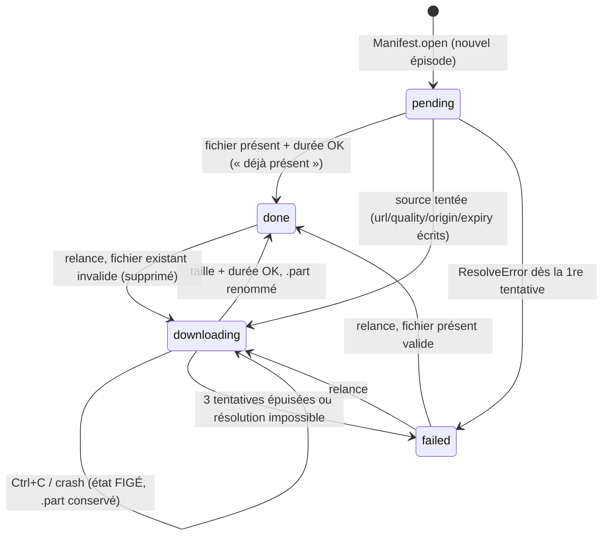

# Inventaire du moteur ShortDramaGen pour le frontend

> Source : code réel v0.1.0 (`shortdramagen/*.py`, commit `3adcf77`), docs `01..03` et `README.md`. Les références `fichier:ligne` pointent vers `/home/user/ShortDramaGen/`. J'ai aussi vérifié hors ligne les messages d'erreur de la CLI (`-e abc`, URL invalide, `film` sans téléchargement, `-q 4k`).

## 0. Corrections du contexte fourni (à propager dans la maquette)

| Affirmation du contexte | Réalité du code |
|---|---|
| Statuts épisode : pending / **resolved** / downloading / done / failed | **`resolved` n'existe pas.** Les statuts réellement écrits sont `pending` (manifest.py:40), `downloading` (pipeline.py:228), `done` (pipeline.py:208, 242) et `failed` (pipeline.py:248). |
| « Interruption : reprise en relançant » | C'est exact, mais **après un Ctrl+C, les épisodes en cours restent en `downloading` dans le manifest** (l'exception `Cancelled`, pipeline.py:197, n'est pas interceptée et aucun statut n'est remis à jour). Le frontend ne peut pas faire confiance à `downloading` si aucun job ne tourne. |
| « Film : refuse si qualités mélangées sauf --reencode, manquants sauf --allow-missing » | C'est vrai pour `sdg film`. En revanche, **`fetch --film` ne transmet ni `reencode`, ni `allow_missing`, ni `chapters`** (cli.py:156). Il fait toujours une copie, avec chapitres et sans tolérer de manquant. |
| Cover portrait 360×640 | Seule l'**URL distante** est gardée (`@w=360&h=640`), rien n'est téléchargé en local (official.py:83, manifest.py:34). |
| Manifest « par série » | Il y a un manifest **par dossier**, donc par couple (série, version vidéo). La VF, la VE et la VO font 3 dossiers et 3 manifests (pipeline.py:170-174). |

---

## 1. Actions utilisateur et options

### 1.1 Les 4 commandes existantes

| Action UI | Commande | Réseau | Écrit sur disque | Réf |
|---|---|---|---|---|
| **Analyser une URL** (aperçu de la série) | `info <url> [--lang]` | Site officiel + 1 appel `get_video` sur le **dernier** épisode | Rien | cli.py:61-63, 115-134 |
| **Télécharger** | `fetch <url> [--lang] [-q] [-e] [-o] [-j] [--film] [--ffmpeg]` | Officiel + `get_video` par épisode + CDN | Dossier série, `E###.mp4`, `.part`, `manifest.json`, film optionnel | cli.py:65-72, 137-157 |
| **Exporter les liens** (aria2c, IDM) | `links <url> [--lang] [-q] [-e] [--json]` | Officiel + `get_video` par épisode | **Rien** (pas de manifest) | cli.py:74-78, 231-240 ; pipeline.py:271-293 |
| **Créer le film** | `film` (alias `concat`) `<dossier\|url\|id> [--lang] [-o] [-f] [--reencode] [--allow-missing] [--no-chapters] [--ffmpeg]` | **Aucun** | `<Titre>.mp4` (via `.part`), entrée `film` du manifest | cli.py:80-91, 160-175, 178-201 |

### 1.2 Options, valeurs et défauts

| Option | Commandes | Valeurs | Défaut | Effet exact / remarque UX | Réf |
|---|---|---|---|---|---|
| `url` | info, fetch, links | URL `dramaboxdb.com` (série `/movie/` ou épisode `/ep/`, avec ou sans locale), `dramabox.com/drama/…`, lien de partage, URL dramafren (`detail`/`watch`), paramètre `bookId=`/`book_id=`/`bid=`/`id=`, ou identifiant nu de 8 à 14 chiffres | obligatoire | Donne un `BookRef(book_id, lang)`. **Seule la locale d'une URL officielle** devient la langue : le `lang=` de dramafren est ignoré. Dernier recours : regex `4[12]\d{9}` n'importe où dans l'URL. | inputs.py:10-67 |
| `--lang` | info, fetch, links, film | code de locale (`ko`, `th`, `in`, `ja`, `en`, `fr`, `es`…), texte libre | la locale de l'URL officielle, **sinon la VO** | L'option explicite l'emporte sur la locale de l'URL (`lang or ref.lang`, pipeline.py:72). `en` = pas de préfixe (official.py:26). Si la langue n'est pas dans `languages` : avertissement et VO. Pour `film`, elle sert à choisir le dossier quand plusieurs versions existent. | pipeline.py:72-82 ; film.py:113-123 |
| `-q/--quality` | fetch, links | `best`, `1080p`, `720p`, `540p` | `best` | `best` prend la plus haute. Une valeur cible prend la 1ʳᵉ source de hauteur ≤ cible, **sinon la plus basse**. En `fetch`, les autres sources servent de **repli silencieux**, par hauteur décroissante, ce qui peut mélanger les qualités. `links` ne renvoie que la source choisie. | cli.py:15, 52 ; pipeline.py:138-153 |
| `-e/--episodes` | fetch, links | `"1-10,28,50-"` : n, a-b, a- (fin ouverte) ; espaces tolérés autour des virgules | toutes | Erreur si le format est invalide ou la plage à l'envers. Au-delà du nombre d'épisodes : avertissement et plage ignorée. **Le manifest liste quand même tous les épisodes** : les non sélectionnés restent `pending`. | cli.py:18-36, 53 ; pipeline.py:156-167 |
| `-o/--out` | fetch, film | chemin | `downloads` **relatif au répertoire courant** | Racine de la bibliothèque. Pour `film`, sert seulement si `target` n'est pas un dossier. | cli.py:55-56 |
| `-j/--jobs` | fetch | entier | `3` | Nombre de téléchargements en parallèle. `≤0` est ramené à 1 sans message (`max(1, jobs)`). Les appels API restent espacés de 0,3 s quel que soit ce réglage. | cli.py:69 ; pipeline.py:252 |
| `--film` | fetch | booléen | non | ffmpeg est cherché **avant** tout téléchargement (cli.py:139). Le film est créé seulement s'il n'y a aucun échec. Avec `-e`, il contient **uniquement les épisodes demandés** (`done`+`skipped`). | cli.py:70, 139, 151-156 |
| `--ffmpeg` | fetch, film | chemin ou nom | recherche : `--ffmpeg`, puis `PATH`, puis paquet `imageio-ffmpeg` | Erreur explicite si introuvable. | cli.py:58-59 ; film.py:331-352 |
| `--json` | links | booléen | non (une URL par ligne) | JSON `{title, book_id, episodes:[{episode,file,quality,url,expires_at}]}`. | cli.py:77, 235-239 |
| `target` | film | dossier, URL ou id | obligatoire | S'il s'agit d'un dossier existant, il est utilisé tel quel (même sans manifest : il liste alors les `E###.mp4`). Sinon : `parse_input` puis `find_series_dir` dans `-o`. | cli.py:161-165 ; film.py:101-123, 136-138 |
| `-f/--file` | film | chemin | `<dossier>/<titre>.mp4`, ou `<titre> (épisodes 1-10).mp4` pour un film partiel | Titre nettoyé des caractères `<>:"/\|?*`, espaces fusionnés, 150 caractères max, `film` si vide. **Un fichier existant est écrasé sans confirmation** (`-y`, `os.replace`). | cli.py:86, 192 ; film.py:183-189, 325-328, 235, 227 |
| `--reencode` | film | booléen | non | Ré-encodage libx264 `veryfast` CRF 20 yuv420p + AAC 128k, **au format majoritaire en durée** (mise à l'échelle et bandes noires). Épisode sans son : un silence est généré. Beaucoup plus lent. | cli.py:87 ; film.py:81-87, 247-286 |
| `--allow-missing` | film | booléen | non | Fusionne ce qui est lisible et avertit des manquants. | cli.py:88 ; film.py:154-157 |
| `--no-chapters` | film | booléen | chapitres **activés** | Un chapitre « Épisode N » par épisode. | cli.py:89 ; film.py:304-318 |

### 1.3 Paramètres internes non exposés (candidats à un écran « Réglages avancés »)

| Paramètre | Valeur | Réf |
|---|---|---|
| Espacement des appels API dramafren (`api_interval`) | 0,3 s | pipeline.py:23, 50 |
| Tentatives par épisode | 3 (pauses de 2 s puis 4 s) | pipeline.py:21, 246-247 |
| Épisodes sondés au maximum (mode sonde) | 1000 | pipeline.py:22 |
| Timeout / reprises / backoff HTTP (`get`, `get_json`) | 30 s / 3 / 2 s × 2ⁿ, soit 2, 4 et 8 s | http.py:53, 63-78 |
| Reprise HTTP sur le flux CDN (`stream`) | **aucune** (c'est le pipeline qui réessaie) | http.py:85-97 |
| Taille des blocs de téléchargement | 256 Kio | download.py:15 |
| Tolérance de durée d'un épisode | ±1,0 s | download.py:16, 90 |
| Tolérance de durée du film | 1 s + 0,05 s par épisode | film.py:223 |
| Longueur maximale de la ligne de commande ffmpeg (Windows) | 30 000 caractères (au-delà, `-filter_complex_script`) | film.py:243-261 |
| Endpoints dramafren | `cdn-dramabox`, puis `cdn-dramaboxv2` en secours | dramafren.py:17-20 |

### 1.4 Actions implicites (sans commande dédiée aujourd'hui)

| Action UI | Mécanisme actuel | Réf |
|---|---|---|
| **Reprendre / réessayer les échecs** | Relancer la même commande `fetch`. Un fichier présent **et** de durée correcte est `déjà présent`. Un `.part` est repris par `Range`. | pipeline.py:205-211 ; download.py:40-48 |
| **Annuler / mettre en pause** | Ctrl+C uniquement (`KeyboardInterrupt` → `stop.set()`). Le `.part` est conservé. | pipeline.py:193-197, 258-261 ; cli.py:110-112 |
| **Choisir la version doublée** | `--lang xx`. Chaque version donne un dossier distinct avec le suffixe `-xx`, **seulement si** `source_book_id ≠ book_id`. | pipeline.py:170-174 |
| **Récupérer de nouveaux épisodes** (série en cours) | Relancer `fetch` : `Manifest.open` fusionne la nouvelle liste d'épisodes avec les statuts précédents. | manifest.py:23-50 |
| **Remplacer un fichier invalide** | Automatique au relancement : le fichier est **supprimé** puis retéléchargé. | pipeline.py:212-213 ; download.py:85-94 |

### 1.5 Codes de sortie

| Code | Sens | Réf |
|---|---|---|
| `0` | Tout OK | cli.py:134, 157, 175 |
| `1` | Au moins un échec d'épisode (fetch ou links incomplet), `SeriesNotFound` ou `FilmError` | cli.py:107-109, 153, 240 |
| `2` | Entrée invalide (`InputError`) ou erreur d'argument argparse (`-e`, `-q`…) | cli.py:104-106 |
| `130` | Interrompu (Ctrl+C) : reprise possible | cli.py:110-112 |
| trace Python | Exception non prévue (voir §4.8) | — |

---

## 2. Données affichables et provenance

Légende : **OFF** = page officielle (`__NEXT_DATA__`), **DF** = API dramafren `get_video`, **MAN** = `manifest.json` local, **DISK** = système de fichiers ou `mp4.probe`, **CALC** = dérivé.

### 2.1 Série

| Donnée | Source | Dans le manifest ? | Exemple réel | Réf |
|---|---|---|---|---|
| `book_id` | OFF `bookInfo.bookId` (ou entrée) | oui | `41000105199` | official.py:76 ; manifest.py:29 |
| `source_book_id` (livre qui porte les vidéos de la langue) | OFF `sourceBookId` | oui | VF `41000111625`, VE `41000106297` | official.py:56 ; manifest.py:30 |
| `lang` | OFF `locale` (sinon option, sinon `en`) ; `""` en mode sonde | oui | `fr` | official.py:78 ; pipeline.py:103 ; manifest.py:31 |
| `title` (**localisé**) | OFF `bookName` ; **= book_id en mode sonde** | oui | « Qui Est la Véritable Mme Lafont ? » | official.py:79 ; pipeline.py:104 |
| `slug` (anglais) | OFF `bookNameLower` ou `bookNameEn` slugifié ; `serie` en mode sonde | oui | `one-night-to-forever` | official.py:80, 88-89 |
| `cover` (URL portrait 360×640) | OFF `bookInfo.cover` ; `None` en mode sonde | oui (URL seule) | `…/41000111625.jpg@w=360&h=640` | official.py:83 ; manifest.py:34 |
| `introduction` (synopsis, environ 400 caractères) | OFF | oui | — | official.py:84 ; manifest.py:35 |
| `episode_count` | CALC `len(episodes)` | oui | 62 | models.py:39-41 ; manifest.py:36 |
| `languages` | OFF `languages` | **non** | `ko, th, in, ja, en, fr, es` | official.py:55 |
| `from_official` (mode sonde ou non) | CALC | **non** (on le devine : `lang==""`, `title==book_id`, `slug=="serie"`) | — | models.py:37 ; pipeline.py:100-108 |
| `platform` | constante | oui | `dramabox` | manifest.py:28 |
| `updated_at` (UTC ISO) | MAN (à chaque écriture) | oui | — | manifest.py:84 |
| Dossier de la série | CALC `<bookId>-<slug>[-<lang>]` | implicite | `41000105199-one-night-to-forever-fr` | pipeline.py:170-174 |
| Durée totale | CALC Σ `duration_ms` (officiel uniquement) | calculable | 1 h 32 | cli.py:122-124 |
| Épisodes gratuits (site officiel) | OFF `unlock` et `mp4` | **non** | 1-10 | cli.py:118, 125 ; official.py:71 |
| Disponibilité dramafren et qualités | DF (dernier épisode seulement) | **non** | `OK (… 1080p, 720p, 540p)` | cli.py:129-133 |
| Compteurs done / failed / pending / downloading | CALC depuis MAN | calculable | — | — |
| Taille sur disque | CALC Σ `bytes` (MAN) ou `stat` (DISK) | partielle | 650-720 Mo en 1080p | — |
| Film | MAN `film` | oui | voir 2.4 | film.py:379-394 |

### 2.2 Épisode

| Donnée | Source | Dans le manifest ? | Remarque | Réf |
|---|---|---|---|---|
| `number` (à partir de 1) | OFF `index+1` (ou rang en sonde) | oui | — | official.py:67 ; manifest.py:41 |
| `chapter_id` | OFF `id` (identifiant **VO**, même pour la VF) | oui | En sonde, = `media_id` | official.py:59 ; pipeline.py:96 |
| `media_id` | Chemin CDN de `mp4` ou de `cover` (sinon `chapter_id`) | oui | Diffère de `chapter_id` en version doublée | official.py:60-64 |
| `duration_ms` | OFF `duration` ; `None` en sonde | oui | 50 s à 3 min 30 ; E001 = 153 118 ms | official.py:70 |
| `free_url` (MP4 officiel 720p signé CloudFront, environ 24 h) | OFF si `unlock` | **non** | Badge « gratuit » : épisodes 1-10 | official.py:71 ; doc 01:156-157 |
| `status` | MAN | oui | `pending` / `downloading` / `done` / `failed` | §3.1 |
| `quality` (**réelle**, pas celle demandée) | DF (`Server 1 1080p` → `1080p`) ou déduite de l'URL | oui | Peut valoir `""` si inconnue | pipeline.py:230 ; dramafren.py:45-54 |
| `origin` | `dramafren` ou `official` | oui | `official` = repli 720p pour les épisodes 1-10 | pipeline.py:132, 231 |
| `url` (URL signée de la **dernière source tentée**) | DF ou OFF | oui | **Sensible** (.gitignore:5) : ne pas l'afficher en clair, proposer plutôt « copier » | pipeline.py:229 |
| `url_expires_at` (ISO UTC) | CALC depuis l'URL (jeton Akamai hex ou `Expires`) | oui | Environ 3 semaines (Akamai), environ 24 h (officiel) ; peut être `null` | cdn.py:37-45 ; pipeline.py:225, 232 |
| `file` | `E###.mp4` | oui (si done) | — | pipeline.py:204, 208, 242 |
| `bytes` | Taille finale | oui (si done) | 10 à 14 Mo en 1080p | pipeline.py:208, 242 |
| `error` | Dernier message d'erreur | oui (si failed) | **Reste présent pendant un nouveau `downloading`** : il n'est effacé que sur `done` (manifest.py:75-76) | pipeline.py:248 |
| Présence et taille des `.part` | DISK `E###.<variante>.part` | **non** | Progression d'un téléchargement partiel ; un fichier par variante de qualité | download.py:74-78 |
| Sources et qualités disponibles | DF | **non** | Connues seulement après résolution | pipeline.py:115-135 |

### 2.3 Fichier local (`mp4.probe`, sans ffmpeg)

`Mp4Info` : `duration` (mvhd), `presentation` (après edit lists), piste vidéo (`codec`, `width`, `height`, `config`) et piste audio (`codec`, `sample_rate`, `channels`), plus `describe()` (ex. `avc1 1080x1920, mp4a 44100 Hz 2 canaux`). Sert pour une fiche technique d'épisode et pour les groupes de compatibilité du film. Réf : mp4.py:11-44, 106-133.

### 2.4 Film

| Donnée | Source | Réf |
|---|---|---|
| `film.file` (nom seul si le film est dans le dossier de la série, chemin complet sinon) | MAN | film.py:386 |
| `film.episodes` (liste), `film.missing` (liste) | MAN | film.py:387-388 |
| `film.duration_s`, `film.bytes`, `film.mode` (`copy` ou `reencode`), `film.created_at` | MAN | film.py:389-392 |
| Chapitres activés ? | **non stocké** | — |
| **Pré-vol sans réseau** (`plan_film`) : `parts`, `missing`, `compatible`, `groups` (formats et plages d'épisodes), `duration`, nom par défaut | CALC | film.py:45-87, 129-189 |
| Progression (secondes traitées / total) | ffmpeg `out_time_us` | film.py:28, 364-367 |

**Limite** : il n'y a **qu'une seule entrée `film`**. Un film partiel puis un film complet s'écrasent dans le manifest, même si les deux fichiers restent sur le disque. Rien ne détecte non plus un film devenu « obsolète » parce que des épisodes ont été retéléchargés après sa création.

### 2.5 Liens (`links --json`)
`{title, book_id, episodes:[{episode, file, quality, url, expires_at}]}`. Les épisodes en échec sont absents de la liste et journalisés. Réf : cli.py:236 ; pipeline.py:284-292.

### 2.6 Données de la page officielle disponibles mais NON conservées

Elles seraient utiles à l'UI mais sont jetées par `parse_page_props` (official.py:49-85) :
- `bookInfo` : `chapterCount`, `language` (`FRENCH`), `bookNameEn` (titre VO pour une VF), `tags`, `performerList` (doc 01:141 ; absents de la fixture anonymisée).
- Par épisode : `name` (en chinois, `第一集` : inutilisable, afficher plutôt « Épisode N »), `indexStr` (`001`), **`cover` = vignette de l'épisode**, `utime` (date), `chapterPrice`, **`new`** (badge « nouveau »), `m3u8Url`, `m3u8Flag`.
- `tabData` (`["1-50","51-62"]` : pagination de la grille officielle).
- DF : `subtitles` (vide aujourd'hui), `isHls`, `serverBadgeText`.

### 2.7 Ordres de grandeur réels (pour dimensionner la maquette)
62 épisodes pour 1 h 32. Épisodes de 50 s à 3 min 30. 1080p : 10 à 14 Mo par épisode (E001 : 21,2 Mo), série complète de 650 à 720 Mo, film de 717 Mo. Téléchargement complet en 40 s à 1 min 40 (1 min 38 mesuré). Fusion en environ 6 s. Vidéos verticales 1080×1920, covers 360×640. Titres longs (« Qui Est la Véritable Mme Lafont ? »). Réf : README.md:11, 65 ; doc 03:49.

---

## 3. États et transitions

### 3.1 Épisode : états persistés (manifest)

| Transition | Déclencheur | Réf |
|---|---|---|
| ∅ → `pending` | 1ʳᵉ ouverture du manifest. Les épisodes déjà connus gardent leur entrée. | manifest.py:38-47 |
| * → `done` (saut) | `E###.mp4` existe et `check_duration` réussit. `file` et `bytes` sont mis à jour. | pipeline.py:205-211 |
| * → suppression → téléchargement | Fichier existant invalide : il est **supprimé**, puis journalisé. | pipeline.py:212-213 ; download.py:85-94 |
| → `downloading` | À chaque source tentée. | pipeline.py:224-233 |
| `downloading` → source suivante | `UrlRejected` (401/403/404/410) ou `IntegrityError` | pipeline.py:236-238 |
| `downloading` → nouvelle tentative | `HttpStatusError` (autre) ou erreur réseau : pause de 2×n s puis nouvelle résolution | pipeline.py:239-241, 246-247 |
| → `done` | Téléchargement vérifié. `error` est effacé. | pipeline.py:242-245 ; manifest.py:75-76 |
| → `failed` | Fin des 3 tentatives, ou `ResolveError` (pas de nouvelle tentative au niveau du pipeline, les 2 endpoints ayant déjà réessayé). | pipeline.py:220-223, 248-250 |
| `downloading` figé | Ctrl+C (`Cancelled` / `KeyboardInterrupt`) ou exception inattendue | pipeline.py:195-197, 258-261 |

Phases internes **invisibles** aujourd'hui, à exposer : en file d'attente → attente du rate-limiter → résolution (DF, puis secours v2, puis MP4 officiel) → filtrage `matches_episode` → téléchargement (reprise `Range` ou non) → vérification taille et durée → renommage atomique → nettoyage des `.part`.

### 3.2 États d'épisode dérivés, à afficher dans l'UI (proposition)

| État UI | Règle de dérivation |
|---|---|
| Non téléchargé | `pending` et aucun `.part` |
| Partiel / interrompu | `.part` présent, ou `downloading` sans job actif |
| En file | job actif, épisode sélectionné, pas encore démarré |
| Résolution | job actif, entre la file et le 1er octet (événement à créer) |
| Téléchargement X % | événement d'octets (à créer, voir §5) |
| Vérification | après le dernier octet (événement à créer) |
| Terminé | `done` **et** fichier présent (à vérifier sur le disque) |
| Fichier manquant | `done` mais `E###.mp4` absent (supprimé à la main) |
| Qualité différente | `quality` ≠ qualité demandée, ou ≠ qualité majoritaire de la série |
| Échec | `failed` + `error` |
| Non sélectionné | `pending` hors de la plage `-e` du dernier job (les options du job ne sont pas stockées) |
| Gratuit / Nouveau | `free_url` / `new` (données non conservées aujourd'hui) |

### 3.3 Série (entièrement dérivée, rien n'est stocké)

| État | Règle |
|---|---|
| Aperçu (hors bibliothèque) | `info` fait, aucun dossier |
| Ajoutée / vide | dossier et manifest présents, 0 `done` (le manifest est écrit **avant** le 1er téléchargement : pipeline.py:188-190) |
| Incomplète | 0 < done < `episode_count` |
| Complète | done = `episode_count` et tous les fichiers présents |
| Avec erreurs | ≥ 1 `failed` |
| En cours | job actif (aucun verrou ni signal aujourd'hui) |
| Qualités mélangées | plusieurs `quality` parmi les `done` : le film sans ré-encodage sera refusé |
| Mode sonde | `title == book_id`, pas de durées, pas de cover |
| Film prêt / film partiel / film obsolète | entrée `film` et fichier présent ; `missing` non vide ; (obsolète : non détectable aujourd'hui) |
| Nouveaux épisodes disponibles | `episode_count` distant > local (demande une requête officielle) |

### 3.4 Film

`absent` → **pré-vol** (`plan_film`) → `refusé : manquants` (FilmError, sauf `--allow-missing`) / `refusé : formats mélangés` (FilmError, sauf `--reencode`) / `refusé : ffmpeg absent` → **construction** (progression 0-100 %, `.part`) → **contrôle de durée** → `créé` (renommage atomique + entrée dans le manifest) / `échec ffmpeg` / `durée incorrecte` (`.part` supprimé) / `annulé` (Ctrl+C, `.part` supprimé). Réf : film.py:129-161, 174-230, 355-376.

### 3.5 Jobs

| Job | Phases |
|---|---|
| **fetch** | analyse de l'entrée → (ffmpeg si `--film`) → métadonnées officielles **ou** mode sonde (jusqu'à 1000 appels espacés de 0,3 s, **sans aucune progression affichée**) → avertissement de langue → sélection → création du dossier et du manifest → pool de N workers → bilan `Terminé : …` → film optionnel. Issues : OK (0), échecs partiels (1), entrée invalide (2), interrompu (130), exception non gérée. Réf : cli.py:137-157 ; pipeline.py:184-268. |
| **film** | localisation du dossier → recherche de ffmpeg → plan → compatibilité → fusion → contrôle. |
| **links** | métadonnées → résolution séquentielle (sans parallélisme) → liste. |
| **info** | métadonnées → sonde DF du dernier épisode. |

Aucun job n'est persisté. Il n'y a ni identifiant de job, ni file d'attente, ni verrou.

### 3.6 Incohérences d'état que le frontend doit gérer
1. `downloading` figé après une interruption (§0).
2. `done` alors que le fichier a été supprimé à la main : le manifest n'est pas réconcilié tant que `fetch` ne tourne pas.
3. `error` résiduel sur un épisode en `downloading` (manifest.py:75-76).
4. `url`, `quality` et `origin` d'un épisode `failed` désignent la **dernière source tentée**, pas une source valide.
5. Un épisode `done` en 720p **n'est jamais retéléchargé** si on redemande `-q 1080p` : il est considéré comme déjà présent (pipeline.py:205-211).
6. Des `.part` orphelins restent après un échec définitif ou un changement de qualité. Ils ne sont nettoyés qu'au succès de l'épisode (download.py:69-70).
7. Si une langue demandée n'a pas de doublage (`source_book_id == book_id`), le dossier n'a pas de suffixe et c'est **celui de la VO**. `Manifest.open` y écrase alors `title` et `lang` avec la locale demandée (manifest.py:27-37 ; pipeline.py:172). Point non vérifié en réel.
8. Une série téléchargée en mode sonde (`<id>-serie`) puis retrouvée sur le site officiel donne **deux dossiers** différents.
9. Deux jobs sur le même dossier : le verrou du manifest n'existe qu'entre threads (manifest.py:20). Les `.part` sont partagés, avec un risque de corruption.

---

## 4. Erreurs et avertissements (messages exacts)

### 4.1 Entrée (code de sortie 2)
| Message | Réf | Reprise UI |
|---|---|---|
| `URL non reconnue : '<texte>'` | inputs.py:44 | Validation dans le champ, avec exemples |
| `Impossible de trouver l'identifiant de la série dans : '<texte>'` + `Formats acceptés : URL dramaboxdb.com / dramabox.com, lien de partage, URL dramafren ou identifiant numérique (ex. 41000105199).` | inputs.py:63-66 (vérifié) | Idem |
| `argument -e/--episodes: plage d'épisodes invalide : 'abc'` | cli.py:27 (vérifié) | Sélecteur visuel dans la grille |
| `argument -e/--episodes: plage d'épisodes à l'envers : '10-3'` | cli.py:34 | Idem |
| `argument -q/--quality: invalid choice: '4k' (choose from …)` (anglais, argparse) | cli.py:52 (vérifié) | Liste fermée |

### 4.2 Métadonnées
| Message | Réf | Conséquence / reprise |
|---|---|---|
| `Série <id> introuvable sur https://www.dramaboxdb.com` (404) | official.py:36 | Converti en avertissement, puis mode sonde |
| `Pas de données __NEXT_DATA__ pour la série <id>` | official.py:44 | Mode sonde |
| `Série <id> introuvable (page vide ou 404)` | official.py:53 | Mode sonde |
| ⚠ `Attention : <message ci-dessus>. Détection des épisodes via dramafren (sans contrôle de durée).` | pipeline.py:76 | Bandeau « Mode dégradé : titre, durées et cover indisponibles » |
| `Aucun épisode trouvé pour <id>, ni sur le site officiel ni sur dramafren` | pipeline.py:99 | Code 1 : état vide « Série introuvable » |
| ⚠ `Attention : langue « <xx> » indisponible pour cette série, version originale utilisée (disponibles : ko, th, …)` | pipeline.py:79-82 | Désactiver les langues absentes dans le sélecteur (seulement si `languages` est non vide) |
| ⚠ `Attention : la série compte <N> épisodes, ignoré au-delà : <plages>` | pipeline.py:166 | Borner la sélection |

### 4.3 Résolution
| Message | Réf | Reprise |
|---|---|---|
| `Épisode <n> indisponible sur dramafren (<endpoint1>: <err>; <endpoint2>: <err>)`. `<err>` vaut `HTTP <code> pour <url>`, une erreur JSON, le champ `error` de l'API (ex. `Video unavailable`) ou `réponse invalide`. | dramafren.py:36-42 | L'épisode passe en `failed` (pas de nouvelle tentative au niveau du pipeline). Bouton « Réessayer ». |
| `aucune URL ne correspond à cet épisode` (toutes les URL DF rejetées par le contrôle du chemin CDN, et pas de MP4 gratuit) | pipeline.py:134 | `failed`. Signal d'anomalie côté dramafren. |
| `dramafren    : indisponible (<e>)` (info) | cli.py:133 | Badge rouge dans l'aperçu, téléchargement déconseillé |
| `E<nnn> ÉCHEC : <e>` (links) | pipeline.py:280 | Ligne en erreur, code 1 |

### 4.4 Téléchargement et intégrité
| Message (champ `error` du manifest) | Réf | Comportement / reprise |
|---|---|---|
| `<origin> <quality> : HTTP 403 pour <url>` (401/403/404/410 → `UrlRejected`, URL expirée ou invalide) | download.py:60-61 ; pipeline.py:236-238 | Source suivante, puis nouvelle résolution automatique |
| `<origin> <quality> : téléchargement incomplet : <n> octets reçus sur <total>` | download.py:66 | Source suivante |
| `<origin> <quality> : MP4 illisible : <e>` / `MP4 illisible (pas de boîte moov/mvhd)` | download.py:86, 89 | Fichier supprimé, source suivante |
| `<origin> <quality> : durée <x> s au lieu de <y> s (mauvais fichier ?)` | download.py:92-94 | Fichier supprimé, source suivante (contrôle absent en mode sonde) |
| `HTTP <5xx/429/…> pour <url>` ou erreur réseau (`OSError`, `IncompleteRead`) | pipeline.py:239-241 | Pause de 2 s ou 4 s, nouvelle résolution, 3 tentatives au maximum |
| HTTP 416 sur reprise | download.py:56-59 | Silencieux : le `.part` est supprimé et le téléchargement repart de zéro |
| `inconnue` (valeur par défaut, théorique) | pipeline.py:215 | — |
| Journal `[....] E<nnn> fichier existant invalide (<e>), nouveau téléchargement` | pipeline.py:213 | Avertissement : **le fichier a été supprimé** |
| Journal `[i/N] E<nnn> ÉCHEC : <error>` | pipeline.py:250 | Épisode rouge + « Réessayer » |
| Journaux de succès `[i/N] E<nnn> <q> <x> Mo  OK` / `[i/N] E<nnn> déjà présent` | pipeline.py:244, 210 | Progression globale |
| Bilan `Terminé : <n> épisode(s) OK (<d> téléchargé(s), <s> déjà présent(s)), <f> échec(s).` | cli.py:145-147 | Toast de fin |
| `Épisodes en échec : [..]. Relance la même commande pour réessayer.` | cli.py:150 | Bouton « Réessayer les échecs » |
| `Film non créé : il manque des épisodes.` | cli.py:152 | CTA film désactivé, avec raison |
| `\nInterrompu. Relance la même commande pour reprendre.` (130) | cli.py:111 | État « En pause » + « Reprendre » |

Repli de qualité **silencieux** : aucun message quand la qualité obtenue diffère de la demande (pipeline.py:224). Le seul indice est la qualité affichée dans la ligne OK.

### 4.5 Film (`FilmError`, code 1)
| Message | Réf | Reprise |
|---|---|---|
| `Aucun téléchargement trouvé pour <id> dans <out>. Lance d'abord : sdg fetch <id>` | film.py:109-112 (vérifié) | CTA « Télécharger » |
| `Précise la langue avec --lang ou donne le dossier directement. Trouvés : <dossier> (langue xx), …` | film.py:122-123 | Sélecteur de version |
| `Aucun épisode dans <dossier>` / `Aucun épisode lisible dans <dossier>` | film.py:140, 160 | — |
| `Épisodes absents ou illisibles : <plages>. Relance « sdg fetch » pour les récupérer, ou utilise --allow-missing pour fusionner sans eux.` | film.py:155-157 | Deux boutons : « Télécharger les manquants » et « Film partiel » |
| `Les épisodes n'ont pas tous le même format, la fusion sans ré-encodage est impossible (<avc1 1080x1920, mp4a 44100 Hz 2 canaux : épisodes 1-9, 11-62; avc1 720x1280, … : épisodes 10>). Retélécharge les épisodes à part dans la même qualité, ou ajoute --reencode (plus lent).` | film.py:174-180, 164-168 | Deux boutons : « Retélécharger E10 en 1080p » (demande un mode forcé, §5) et « Ré-encoder (lent) » |
| `ffmpeg introuvable à l'emplacement indiqué : <chemin>` | film.py:336 | Réglages |
| `ffmpeg est nécessaire pour la fusion. Au choix :` + `pip install imageio-ffmpeg` / `winget install Gyan.FFmpeg` / `brew …` / `apt …` / `--ffmpeg` | film.py:347-352 | Assistant d'installation (sous Windows : winget ou imageio) |
| `Impossible de lancer ffmpeg : <e>` | film.py:362 | Réglages |
| `ffmpeg a échoué :\n  <5 dernières lignes du log>` (ou `code <n>`) | film.py:373-376 | Détails repliables |
| `Film incorrect : durée <x> s au lieu de <y> s attendues` | film.py:226 | Réessayer ou ré-encoder |
| ⚠ `Attention : épisodes absents, film incomplet (manquent : <plages>)` | cli.py:191 | Bandeau « film partiel » |
| ℹ `Fusion de <n> épisodes (<h min s>, sans ré-encodage \| avec ré-encodage, c'est long) -> <chemin>` / `Film créé : <chemin> (<durée>, <x> Mo)` | cli.py:193-194, 200 | Progression et toast |

### 4.6 Erreurs NON gérées (trace Python aujourd'hui)
- `HttpStatusError` autre que 404 sur le site officiel (403, 5xx après reprises), ainsi que les erreurs réseau et DNS : official.py:33-37 relance, pipeline.py:75 n'intercepte que `SeriesNotFound`, cli.py:102-112 non plus.
- `JSONDecodeError` sur un `__NEXT_DATA__` invalide (official.py:45) ou sur un `manifest.json` corrompu (manifest.py:25, 58 ; film.py:107, 133).
- `PermissionError` sous Windows sur `os.replace` si un `E###.mp4` ou le film est ouvert dans un lecteur (download.py:68 ; film.py:227 ; manifest.py:87). Point déduit, non testé.
- Espace disque insuffisant (`OSError` en écriture, download.py:49-50) : l'erreur est traitée comme « transitoire » et donne 3 tentatives puis `failed`.
- `mp4.probe` sur un MP4 tronqué dont le `moov` est présent : `struct.error` / `IndexError` possibles dans `plan_film` (mp4.py:81-87, film.py:148). Point déduit.

---

## 5. Ce qui manque au moteur pour un frontend (ajouts Python)

Priorité : **P0** = bloquant pour la maquette cible, **P1** = forte valeur UX, **P2** = confort.

### 5.1 Observabilité et contrôle des jobs
1. **P0 – Événements structurés** à la place des chaînes `log` (pipeline.py:18). Ajouter un `on_event(Event)` typé et garder un adaptateur texte pour la CLI. Événements minimum :
   - `series_loaded`, `probe_progress(n)` (la sonde est muette aujourd'hui, pipeline.py:89-97) ;
   - `lang_fallback`, `selection_clipped` ;
   - `episode_queued`, `episode_resolving`, `episode_resolved(sources)` ;
   - `episode_download_started(source, quality, origin, offset_reprise, total)`, `episode_progress(written, total)` ;
   - `episode_verifying`, `episode_done(bytes, quality, skipped)`, `episode_source_rejected(err)`, `episode_retry(attempt, delay, err)`, `episode_failed(code, msg)`, `quality_fallback(demandée, obtenue)` ;
   - `job_finished(summary)`, `film_planned(plan)`, `film_progress(s, total)`, `film_done`.

   Le crochet d'octets existe déjà (download.py:33, 53-54) mais le pipeline n'y branche que `check_stop` (pipeline.py:195-197, 235). Il faut limiter la fréquence des événements (environ 4 par seconde et par épisode).
2. **P0 – Codes d'erreur stables** (`INPUT_INVALID`, `SERIES_NOT_FOUND`, `PROBE_MODE`, `LANG_UNAVAILABLE`, `EP_UNAVAILABLE`, `URL_MISMATCH`, `URL_REJECTED`, `SIZE_MISMATCH`, `DURATION_MISMATCH`, `MP4_UNREADABLE`, `NETWORK`, `DISK_FULL`, `FILE_LOCKED`, `FFMPEG_MISSING`, `FILM_MISSING`, `FILM_MIXED_FORMATS`, `FILM_DURATION`, `FFMPEG_FAILED`) et un champ `error_code` dans le manifest, à côté du texte libre actuel (pipeline.py:248).
3. **P0 – Annulation programmatique** : `stop` est une variable locale de `fetch` (pipeline.py:193). Il faut injecter un `threading.Event` (dans `FetchOptions` ou en paramètre). **À l'annulation, remettre les épisodes en cours en `pending` ou `interrupted`** (ils restent aujourd'hui en `downloading`). « Pause » = annulation puis reprise `Range`. Pour le film : passer un jeton à `_run_ffmpeg` pour tuer le processus (seul `BaseException` le fait aujourd'hui, film.py:369-372).
4. **P0 – Vitesse et ETA** : débit instantané et lissé par épisode et global, octets restants. Rien n'est mesuré aujourd'hui (idée listée en doc 03:62).
5. **P0 – Intercepter les exceptions non gérées** (§4.6) et les convertir en erreurs utilisateur.
6. **P1 – File de jobs multi-séries persistée** (roadmap 4b, doc 03:50) : identifiant de job, options, état, horodatages, reprise après redémarrage. Le **rate-limiter doit être partagé** entre jobs (un par `fetch` aujourd'hui, pipeline.py:185), avec un plafond global de connexions CDN.
7. **P1 – Verrou par dossier de série** (fichier `.lock` avec le PID) pour interdire deux jobs sur le même dossier (manifest.py:20 ne protège qu'entre threads).
8. **P2 – Journal persistant par job** (aujourd'hui uniquement sur stderr) et statistiques (durée, débit moyen, taille par qualité, doc 03:62).

### 5.2 Bibliothèque
9. **P0 – Index de bibliothèque** `library.scan(out_dir) -> [SeriesSummary]` sans réseau : glob `*/manifest.json` (comme film.py:104-107) plus **réconciliation disque** (fichier présent, taille réelle, `.part`, film présent), compteurs, qualités, taille totale, `updated_at`, verrou actif.
10. **P0 – Manifest enrichi et versionné** (`schema_version`). Champs à ajouter :
    - `languages`, `from_official`, `free_episodes`, `created_at` ;
    - `title_vo` (`bookNameEn`), `tags`, `performers`, `total_duration_ms` ;
    - **options demandées** (quality, lang, episodes, jobs) pour « Reprendre avec les mêmes réglages » ;
    - par épisode : `name/indexStr`, `thumb` (cover), `new`, `utime`, `started_at` / `finished_at`, `attempts`.

    Aujourd'hui ces données sont jetées (official.py:49-85 ; manifest.py:27-47).
11. **P0 – Cache local des images** : `cover.jpg` dans le dossier (et éventuellement les vignettes d'épisodes), pour une bibliothèque hors ligne. Seule l'URL distante est stockée (manifest.py:34).
12. **P0 – Suppression** : `delete_episodes(dir, numbers)` (fichiers, `.part`, statut remis à `pending`), `delete_film(dir)` (fichier et entrée `film`), `delete_series(dir)`, `purge_parts(dir)`. Gérer le cas d'un fichier ouvert sous Windows et demander une confirmation côté UI.
13. **P0 – Retéléchargement forcé / changement de qualité** : `redownload(dir, numbers, quality)` ou `FetchOptions.force`. Aujourd'hui un fichier valide est toujours sauté, quelle que soit sa qualité (pipeline.py:205-211), ce qui bloque la sortie de l'erreur « formats mélangés » sans ré-encodage.
14. **P1 – Vérification non destructive** (`sdg verify`, roadmap doc 03:50) : `check_duration` **supprime** le fichier fautif (download.py:85-94). Il faut une variante qui produise un rapport, puis laisser l'utilisateur décider.
15. **P1 – Rafraîchir les métadonnées / détecter les nouveaux épisodes** sans télécharger : fonction qui recharge la page officielle, applique `Manifest.open` et renvoie le diff (nouveaux épisodes, `new`). `Manifest.open` n'est appelé que dans `fetch` (pipeline.py:190). Idée « Veille » : doc 03:59.
16. **P1 – Film** :
    - API de **pré-vol** qui renvoie `plan_film` + `ensure_joinable` sous forme de rapport au lieu de lever une exception (film.py:129-180) : compatible ou non, groupes, manquants, nom par défaut, durée et taille estimées ;
    - stocker `chapters` ;
    - gérer **plusieurs films** (liste au lieu de la clé unique `film`, film.py:383) ;
    - détecter un film obsolète (épisode modifié après `created_at`) ;
    - confirmation d'écrasement (film.py:227).
17. **P1 – Catalogue des langues** : pour chaque code de `languages`, le titre localisé et un indicateur doublée / non doublée (`sourceBookId ≠ bookId`). Il faut une requête par locale, à mettre en cache. Il faut aussi corriger le nommage des dossiers pour une langue non doublée (§3.6-7).
18. **P1 – Estimations avant téléchargement** : taille (HEAD sur les URLs résolues, ou estimation depuis la durée et le débit par qualité) et **espace disque libre** (`shutil.disk_usage`).
19. **P2 – Recherche par titre** (onglet « Search Title » de dramafren) : le moteur n'accepte qu'une URL ou un identifiant. La recherche sur dramaboxdb n'a pas été étudiée : hors périmètre, à explorer.
20. **P2 – Re-résolution à la demande** des liens expirés (`url_expires_at` dépassé) pour l'export `links`.

### 5.3 Intégration et réglages
21. **P0 – Couche de service locale** qui respecte la contrainte « zéro dépendance » : `sdg ui` avec `http.server.ThreadingHTTPServer` lié à **127.0.0.1 uniquement**, API JSON et **SSE** pour les événements, UI statique servie par Python, ouverture auto du navigateur via `webbrowser`. Il faut aussi servir les MP4 locaux **avec `Range`** pour un lecteur vertical 9:16 intégré. Endpoints minimum :
    - `POST /api/inspect`, `POST /api/jobs` (fetch/film/links), `GET /api/jobs[/id]`, `POST /api/jobs/id/cancel`, `GET /api/events` (SSE) ;
    - `GET /api/library`, `GET /api/series/<dir>`, `POST /api/series/<dir>/refresh|verify|redownload|film/plan`, `DELETE /api/series/<dir>[/episodes|/film|/parts]` ;
    - `GET/PUT /api/settings`, `GET /media/<dir>/<fichier>`.
22. **P0 – Réglages persistés** (`settings.json`) : dossier de sortie **absolu** (le défaut `downloads` dépend du répertoire courant, cli.py:56 ; proposer par exemple `%USERPROFILE%\Videos\ShortDramaGen` sous Windows), qualité, langue et parallélisme par défaut, chemin ffmpeg. Exposer aussi l'**état de détection de ffmpeg** (chemin et origine : PATH ou imageio), `find_ffmpeg` ne renvoyant qu'un chemin (film.py:331-352).
23. **P1 – Actions système** : ouvrir le dossier, afficher le fichier dans l'Explorateur, lire l'épisode dans le lecteur externe (`os.startfile` sous Windows).
24. **P1 – Sécurité de l'affichage** : ne jamais exposer `url` en clair dans l'UI ni dans les logs partagés (URLs signées, .gitignore:5), et ne pas proposer de fonction de republication (doc 01 §7).