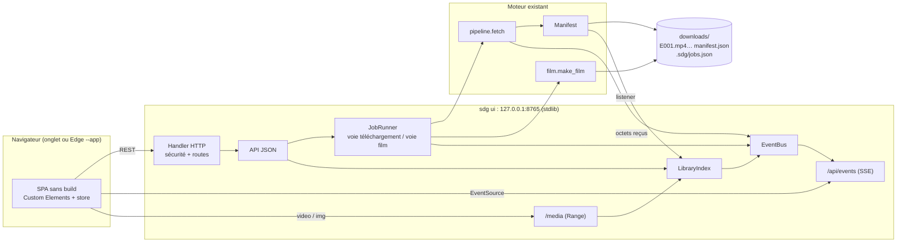
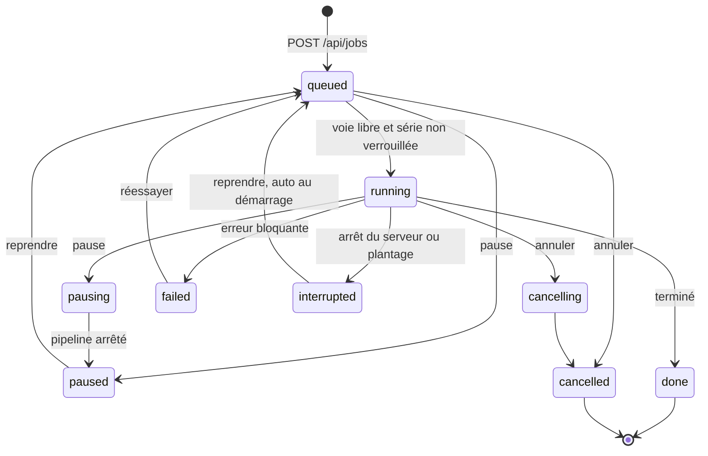

# Frontend ShortDramaGen : architecture technique

> Sources lues : `shortdramagen/` au commit `3adcf77` et `docs/02-architecture.md`. Les références `fichier:ligne` renvoient à ce commit. Ce texte peut devenir `docs/04-frontend-architecture.md`.

## 0. Les décisions en bref

| Sujet | Décision |
|---|---|
| Serveur | `http.server.ThreadingHTTPServer` (bibliothèque standard), écoute sur `127.0.0.1:8765`, lancé par une nouvelle commande `sdg ui` |
| Temps réel | Flux SSE (`GET /api/events`) du serveur vers le client. Les commandes passent en REST/JSON. Pas de WebSocket. |
| Client | HTML, CSS et JS natifs : modules ES et Custom Elements, sans build ni npm. Les fichiers sont servis depuis `shortdramagen/web/`. |
| Fenêtre | Le navigateur par défaut. L'option `--window` ouvre Edge en mode application (`msedge --app=…`), présent sur tout Windows 10/11, sans dépendance. |
| Jobs | File FIFO persistée. Une série se télécharge à la fois (3 épisodes en parallèle). Les fusions ont leur propre voie. La pause arrête proprement, la reprise repart au bon octet grâce à Range. |
| Bibliothèque | Scan de `downloads/*/manifest.json`, cache par date de modification, mises à jour poussées par les jobs. Versions regroupées par `book_id`. |
| Sécurité | Écoute locale seulement, contrôle de l'en-tête `Host`, jeton dans un en-tête, contrôle de `Sec-Fetch-Site`, corps JSON obligatoire. Chaque fichier servi est retrouvé via l'index, jamais via un chemin envoyé par le client. |
| Distribution | D'abord `py -m shortdramagen ui`, puis un zip portable (Python embarquable), puis un `.exe` PyInstaller `--onedir` en V2. |



---

## 1. Ce que le code actuel impose

| # | Constat (vérifié dans le code) | Conséquence |
|---|---|---|
| C1 | `pipeline.fetch` crée son propre `stop = threading.Event()` (`pipeline.py:193`) et ne le déclenche que sur `KeyboardInterrupt` (`:258`). | Il faut pouvoir **passer cet événement de l'extérieur**, sinon ni pause ni annulation depuis l'API. |
| C2 | `download()` appelle `on_progress(written, total)` tous les 256 Kio (`download.py:54`), et `written` inclut l'offset de reprise. Si ce callback lève `Cancelled`, le transfert s'arrête proprement et le `.part` reste. Côté film, `_run_ffmpeg` tue ffmpeg sur toute exception (`film.py:369`) et `build_film` supprime le `.part` (`:218`). | La progression en octets **et** l'annulation passent par le même callback. Il n'y a rien à changer dans `download.py` ni dans le cœur de `film.py`. |
| C3 | `Cancelled` n'est pas intercepté dans `process()` : l'épisode reste en `status: "downloading"` dans le manifest. | Après une pause ou un plantage, le manifest contient des `downloading` orphelins. Il faut les réconcilier (§5.3), et `fetch` doit remettre `pending` quand on annule. |
| C4 | Plusieurs attentes ne sont pas interruptibles : `time.sleep(2 * attempt)` (`:247`), le backoff de `Http.get` (2 + 4 + 8 s), `RateLimiter.wait` et le timeout socket de 30 s. Le mode sonde (`probe_series`, `:89`) peut enchaîner jusqu'à 1000 appels sans tester l'arrêt ni publier de progression. | Pendant un transfert, l'arrêt est quasi immédiat. Sur un réseau bloqué, il peut prendre 30 à 45 s, d'où un état UI « Annulation… » distinct. Il faut remplacer `time.sleep` par `stop.wait` et rendre la sonde interruptible. |
| C5 | Chaque appel de `fetch` crée son propre `RateLimiter` de 0,3 s (`:185`). | Deux séries en parallèle doubleraient le rythme d'appels à dramafren. Le serveur doit **partager un seul limiteur**. |
| C6 | Le manifest est réécrit en entier (JSON puis `os.replace`) à chaque changement d'**état** d'un épisode, jamais pour la progression. Les statuts réellement écrits sont `pending`, `downloading`, `done` et `failed`. `resolved` n'est jamais écrit. | La progression en octets reste en mémoire (sinon environ 50 réécritures par épisode). Un hook sur `Manifest.update` suffit pour pousser les changements d'état vers l'UI. |
| C7 | `fetch` saute tout `E0xx.mp4` présent dont la durée est correcte (`:205`), **quelle que soit sa qualité**. | Pour « retélécharger l'épisode 12 en 1080p » (qualités mélangées qui bloquent la fusion), il faut une option `force`. Le remplacement reste sûr : `os.replace` n'écrase l'ancien fichier qu'après vérification du nouveau (`download.py:68`). |
| C8 | `load_series` passe en mode sonde si la série est absente du site officiel. | L'**aperçu** ne doit jamais sonder : il interroge le site officiel plus un seul `get_video`. La sonde se fait dans le job, avec une progression (« 34 épisodes détectés… »). |
| C9 | L'enchaînement « plan, contrôles, nom par défaut, fusion » vit dans `cli.make_film` (`cli.py:178`), mêlé aux `print`. `FilmError` ne porte qu'un message. | Déplacer `make_film` dans `film.py`, et donner un `code` à `FilmError` pour que l'UI propose la bonne action. |
| C10 | `film.file` peut être un **chemin absolu hors de la série** (`film.py:386`, option `-f`). Le manifest ne garde que l'URL distante de la cover. | Ne jamais servir ni ouvrir un fichier sur la seule foi du manifest (§6.4). Mettre la cover en cache local (`cover.jpg`). |
| C11 | Sous Windows, un fichier ouvert (vidéo en lecture via le serveur, ou dans VLC) ne peut être ni supprimé ni remplacé (`WinError 32`). | Le service média tient les fichiers ouverts le moins longtemps possible (§3.5), et l'UI coupe le lecteur avant une suppression. |
| C12 | Vérifié sous Python 3.11 : `SimpleHTTPRequestHandler` ne gère pas `Range`, et `HTTPServer.allow_reuse_address = 1` active `SO_REUSEADDR`. Sous Windows, cela laisse un autre processus s'attacher au même port. | Écrire le support de Range (environ 50 lignes). Désactiver la réutilisation d'adresse sous Windows et utiliser `SO_EXCLUSIVEADDRUSE`. |

---

## 2. Choix d'architecture

### 2.1 Comparatif des options serveur et application

Notes de 1 (mauvais) à 5 (excellent).

| Critère | **A. Serveur stdlib + SSE + SPA statique** | B. FastAPI/uvicorn + SPA | C. pywebview (fenêtre) au-dessus de A | D. Tauri + Python en sidecar | E. NiceGUI | F. Streamlit | G. Tkinter |
|---|---|---|---|---|---|---|---|
| Zéro dépendance | **5** : stdlib seule | 1 : une douzaine de paquets (starlette, pydantic et son binaire compilé, uvicorn, anyio…) | 2 : pywebview + pythonnet/clr-loader sous Windows | 1 : Rust et Node au build, Python gelé | 1 : environ 25 paquets (FastAPI, socket.io, Vue/Quasar) | 0 : pandas, pyarrow, numpy… plus de 100 Mo | 5 |
| Installation Windows | **5** : `py -m shortdramagen ui` | 3 : venv + pip | 3 : WebView2 est présent, mais pythonnet suit parfois avec retard les nouvelles versions de Python | 2 : facile pour l'utilisateur (installeur), lourd pour le développeur | 3 | 2 | 4 : Tk est dans l'installeur python.org |
| Progression en temps réel | 4 : SSE maison d'environ 80 lignes ; un flux à sens unique suffit | 5 : async, SSE et WebSocket natifs | 4 (comme A) | 4 : événements IPC | 5 : push WebSocket natif | 2 : le script est ré-exécuté à chaque interaction, les tâches de fond sont bancales | 3 : sondage avec `after()` |
| Vidéo dans le navigateur (Range) | 4 : à écrire, mais on maîtrise tout (plafond de plage, verrous Windows) | 4 : `FileResponse` des versions récentes de Starlette gère Range | 4 : WebView2 = Chromium, H.264/AAC OK | 3 : protocole d'assets ou serveur à ajouter | 4 | 3 : `st.video` | **0** : pas de lecteur sans libvlc |
| Maintenabilité (un seul développeur) | 4 : environ 30 routes, pipeline threadé réutilisé tel quel | 4 : validation et OpenAPI automatiques, mais pont asyncio vers threads à gérer | 4 : fine couche sur A | 2 : trois langages, deux toolchains | 3 : UI et état serveur couplés | 2 : dépassé dès qu'il y a une file de jobs | 2 : widgets impératifs |
| Packaging `.exe` | **5** : PyInstaller sans imports cachés, ou zipapp, ou Python embarquable | 3 : imports cachés d'uvicorn, binaire plus lourd | 4 : vraie fenêtre | 4 : installeur léger + sidecar d'environ 20 Mo | 3 : `nicegui-pack` | 1 : réputé difficile | 5 |
| Liberté UX/UI | 5 | 5 | 5, plus une boîte native de choix de dossier | 5 | 3 : look Quasar/Material | 2 : mise en page imposée | 1 |
| **Total sur 35** | **32** | 25 | 26 | 21 | 22 | 12 | 20 (éliminé : pas de vidéo) |

### 2.2 Recommandation : option A, avec un mode fenêtre sans dépendance

- **Fidèle au principe fondateur** (docs/02 §5 : aucune dépendance, `python -m` marche sans `pip`). Le serveur fait environ 1200 à 1500 lignes de bibliothèque standard.
- **Même modèle que le moteur.** Le pipeline est fait de threads (`ThreadPoolExecutor`, `threading.Event`, callbacks). Un serveur threadé s'y branche directement. FastAPI imposerait un pont asyncio sans rien apporter : un seul utilisateur, moins de 10 connexions.
- **SSE couvre tout le besoin de push.** Les commandes sont de simples POST.
- **Range écrit par nous.** Cela permet le comportement spécifique à Windows (plages plafonnées, donc fichiers tenus ouverts peu de temps) qu'aucun framework ne propose d'office.
- **Mode fenêtre.** `sdg ui --window` lance `msedge --app=http://127.0.0.1:8765/ --window-size=1280,860`. On obtient une fenêtre sans barre d'adresse, avec sa propre icône dans la barre des tâches. Si Edge est introuvable, on se rabat sur `webbrowser.open`. pywebview ne vient qu'en option `[desktop]`, si des boîtes de dialogue natives deviennent indispensables.
- **Écoute sur 127.0.0.1 : pas de fenêtre du pare-feu Windows** au premier lancement, contrairement à `0.0.0.0`.
- **Ce qu'on perd face à B** : la validation et l'OpenAPI automatiques. On compense avec un petit `validate.py`, le contrat du §3 et des tests via `http.client`.

**Cycle de vie.**
1. `sdg ui` lit `server.json` (pid, port). Si une instance répond sur `/api/health`, on ouvre simplement le navigateur dessus : **une seule instance**.
2. Sinon, le serveur écoute sur le port 8765 (ou le premier libre de 8766 à 8775), charge les réglages et les jobs, démarre le runner, puis ouvre le navigateur ou la fenêtre.
3. **Arrêt automatique** après 10 minutes sans client SSE et sans job actif (réglable). Cela permet un lanceur `pythonw` sans console, sans laisser de processus zombie. Il y a aussi un bouton « Quitter » (`POST /api/shutdown`).

**Où vit l'état.**
- Dans `%LOCALAPPDATA%\ShortDramaGen\` (`~/.config/shortdramagen` ailleurs) : `settings.json`, `secret`, `server.json`, `server.log` en rotation, `cache/covers/` pour les aperçus. Les réglages contiennent eux-mêmes le chemin du dossier de téléchargement, donc ils ne peuvent pas vivre dedans.
- Dans `<downloads>/.sdg/` : `jobs.json` et `trash/`. La corbeille sur le même volume rend la suppression et son annulation instantanées (un simple renommage), et les jobs restent à côté des données qu'ils décrivent.

**Nouveaux modules.**

```
shortdramagen/
  events.py      # EventBus : pub/sub thread-safe, numéros de séquence, tampon de rejeu
  jobs.py        # Job, JobStore (jobs.json), JobRunner (voies), agrégateur de progression
  library.py     # LibraryIndex : scan, cache, réconciliation, regroupement par langues
  settings.py    # lecture/écriture atomique + validation
  server/
    app.py       # ThreadingHTTPServer, table de routes, helpers JSON, commande `sdg ui`
    api.py       # handlers : (requête) -> (statut, corps)
    media.py     # fichiers avec Range
    sse.py       # flux /api/events
    security.py  # Host, Origin, Sec-Fetch-Site, jeton, en-têtes, liste blanche statique
  web/           # client (§2.3)
```

### 2.3 Côté client

| Option | Build / npm | Code tiers embarqué | Mises à jour fines (barres, grille de 62 à 1000 cases) | CSP stricte (sans `eval`) | Coût pour un développeur Python | Verdict |
|---|---|---|---|---|---|---|
| **JS natif (modules ES) + Custom Elements + mini-store à signaux** | non | aucun | excellent : on change un `data-status` ou une variable CSS | oui | moyen, demande de la discipline | **Recommandé** |
| Preact + htm (+ signals), copiés dans le dépôt (~10 Ko) | non | 3 fichiers sous licence MIT | très bon | oui | faible | **Plan B** si l'UI grossit |
| Alpine.js copié dans le dépôt | non | 1 fichier (~45 Ko) | bon | non, sauf le build « CSP » restreint | faible | Non : expressions évaluées dans le HTML, logique éparpillée |
| htmx + fragments HTML générés en Python | non | 1 fichier + extension SSE | moyen : on remplace des fragments entiers | partiel | moyen : du HTML dans des f-strings | Non : mal adapté à une progression fine |
| Lit copié dans le dépôt | non | ~15 Ko | bon | oui | moyen | Possible, mais le Shadow DOM complique le thème global |
| Svelte / Vue / React + Vite | oui (Node) | build versionné ou produit en CI | excellent | oui | élevé : toolchain Node sous Windows, deux écosystèmes | Non pour ce projet |

**Pourquoi le JS natif ici.** L'interface compte environ 6 écrans et une quinzaine de composants. Le chemin critique est la progression : 3 cases actives à rafraîchir 4 fois par seconde. Avec des références DOM directes, c'est du réglage « fin » naturel, sans DOM virtuel. On édite, on fait F5, on débogue dans les DevTools sans source maps, sans chaîne d'approvisionnement.

**Règles de construction**
- Custom Elements **en light DOM** (sans Shadow DOM), avec une seule feuille CSS de jetons (`--bg`, `--accent`…). Thème bleu nuit par défaut, proche de dramafren, avec une variante claire.
- Store à signaux maison d'environ 50 lignes (`signal`, `computed`, `effect`). Les événements SSE modifient le store, les composants s'y abonnent.
- **La grille d'épisodes est pilotée par attributs.** Chaque case est un `<button data-status="done" data-quality="1080p" style="--p:.42">`, et c'est la CSS qui dessine l'état. Un événement de progression ne touche que `--p` des cases actives. Le rendu reste fluide jusqu'à 1000 cases.
- Routeur par hash (`#/`, `#/file`, `#/bibliotheque`, `#/serie/<clé>`, `#/reglages`) : aucun repli nécessaire côté serveur, et le bouton Retour fonctionne.
- Éléments natifs : `<dialog>` (confirmations, ajout), Popover API, `<video>`. Mise en forme avec `Intl` en `fr-FR` : « 684 Mo », « 1 h 32 », « il y a 3 min ».
- Icônes : un sprite SVG (sous-ensemble de Lucide, licence ISC).
- **Porte de sortie** : si l'état devient pénible à gérer, on passe à Preact + htm copié dans le dépôt, composant par composant. Un Custom Element peut héberger un rendu Preact.

```
shortdramagen/web/
  index.html        # coquille : <sdg-app>, <meta name="sdg-token">, app.css, js/main.js
  app.css  icons.svg
  js/ main.js api.js sse.js store.js router.js format.js langs.js
      views/       add.js queue.js library.js series.js settings.js
      components/  sdg-job-card.js sdg-episode-grid.js sdg-player.js sdg-cover.js sdg-toast.js sdg-confirm.js
```

`langs.js` fait correspondre les codes aux noms, y compris **`in` = indonésien**. C'est le code utilisé par DramaBox, alors que la norme ISO dit `id`.

---

## 3. Contrat d'API

### 3.1 Conventions
- Base `http://127.0.0.1:8765`. JSON en UTF-8 (`ensure_ascii=False`), clés en `snake_case`, dates ISO 8601 en UTC, tailles en octets, durées en secondes. L'UI se charge de la mise en forme.
- **`series_key`** identifie une version de série. C'est le nom du dossier, par exemple `41000105199-one-night-to-forever-fr`, qui respecte `^\d{8,14}-[a-z0-9-]{1,120}$`. En mode sonde, cela donne `41000105199-serie`.
- Les épisodes s'écrivent comme dans la CLI (`"1-10,28,50-"`) ou en liste d'entiers.
- Tout `/api/*` exige l'en-tête `X-SDG-Token`. Les mutations exigent `Content-Type: application/json`.
- Codes HTTP : 200, 201 (job créé), 202 (action asynchrone acceptée), 204, 304, 400, 403, 404, 409 (doublon ou série occupée), 413, 415, 416, 421, 422 (entrée invalide), 423 (fichier verrouillé sous Windows), 500.
- Format d'erreur :

```json
{"error": {"code": "invalid_input", "message": "Impossible de trouver l'identifiant de la série dans : 'https://exemple.com'", "details": {}}}
```

Codes d'erreur stables, que l'UI associe à un texte et à une action : `invalid_input`, `invalid_lang`, `invalid_episodes`, `series_not_found`, `source_unavailable`, `network`, `not_found`, `duplicate_job`, `series_busy`, `ffmpeg_missing`, `film_mixed_formats`, `film_missing_episodes`, `film_failed`, `disk_space`, `file_locked`, `outside_library`, `forbidden`.

### 3.2 Liste des routes

| Méthode | Chemin | Rôle |
|---|---|---|
| GET | `/api/health` | Version, ffmpeg, dossier, espace libre |
| POST | `/api/preview` | **Analyser une URL** (aperçu) |
| GET | `/media/preview/{book_id}/{lang}/cover` | Cover d'un aperçu (cache) |
| GET | `/api/jobs` | Jobs actifs et historique |
| POST | `/api/jobs` | **Créer un job** (`fetch` ou `film`) |
| GET | `/api/jobs/{id}` | Détail d'un job |
| POST | `/api/jobs/{id}/pause` · `/resume` · `/cancel` | Contrôle d'un job |
| POST | `/api/jobs/{id}/move` | Réordonner la file (V2) |
| DELETE | `/api/jobs/{id}` | Retirer un job terminé de l'historique |
| POST | `/api/queue/pause-all` · `/resume-all` | Toute la file (V1.1) |
| GET | `/api/library` | **Bibliothèque** regroupée |
| GET | `/api/series/{key}` | **Détail** d'une version |
| DELETE | `/api/series/{key}?scope=all\|episodes\|film\|parts` | **Supprimer** (via la corbeille) |
| POST | `/api/trash/{trash_id}/restore` | Annuler une suppression |
| POST | `/api/series/{key}/retry` | **Réessayer** les échecs et les manquants |
| POST | `/api/series/{key}/redownload` | Retélécharger des épisodes dans une qualité donnée |
| GET | `/api/series/{key}/film/plan` | Contrôles avant fusion, avec remèdes proposés |
| POST | `/api/series/{key}/film` | **Créer le film** (raccourci de `POST /api/jobs`) |
| POST | `/api/series/{key}/open` | Ouvrir le dossier, le film ou un épisode dans Windows |
| GET, HEAD | `/media/series/{key}/episodes/{n}` | Vidéo d'un épisode (Range) |
| GET, HEAD | `/media/series/{key}/film` | Film (Range) |
| GET | `/media/series/{key}/film/chapters.vtt` | Chapitres au format WebVTT |
| GET | `/media/series/{key}/cover` | Cover locale |
| GET · PATCH | `/api/settings` | Réglages |
| GET | `/api/events` | Flux SSE |
| POST | `/api/shutdown` | Arrêter le serveur (met les jobs en pause) |

Les médias vivent sous `/media/` parce que `<video>` et `` ne peuvent pas envoyer d'en-tête personnalisé. Leur protection est différente (§6.3).

### 3.3 Détail et exemples

**`GET /api/health`**
```json
{"version": "0.2.0", "api": 1, "platform": "win32", "python": "3.12.6",
 "downloads_dir": "C:\\Users\\Nouamane\\Videos\\ShortDramaGen", "free_bytes": 182340000000,
 "ffmpeg": {"found": true, "path": "C:\\ffmpeg\\bin\\ffmpeg.exe", "source": "PATH"},
 "jobs": {"running": 1, "queued": 2}}
```

**`POST /api/preview`** : analyse synchrone, jamais de sonde. Le site officiel et un `get_video` sur le dernier épisode sont interrogés en parallèle (environ 1 s). Le résultat est mis en cache 15 minutes par `(book_id, lang)`.
```json
{"input": "https://www.dramaboxdb.com/fr/movie/41000105199/one-night-to-forever", "lang": null}
```
Avec `lang: null`, c'est la langue de l'URL qui compte (`/fr/`), sinon la VO. Réponse `200` :
```json
{
  "book_id": "41000105199",
  "lang": "fr", "lang_source": "url",
  "source_book_id": "41000111625", "is_original": false,
  "title": "Qui Est la Véritable Mme Lafont ?",
  "introduction": "…",
  "cover_url": "/media/preview/41000105199/fr/cover",
  "from_official": true,
  "episode_count": 62,
  "duration_s": 5521,
  "episode_duration_s": {"min": 50, "max": 212},
  "free_episodes": "1-10",
  "languages": ["ko", "th", "in", "ja", "en", "fr", "es"],
  "availability": {"dramafren": "ok", "checked_episode": 62, "qualities": ["1080p", "720p", "540p"]},
  "estimate": {"quality": "1080p", "bytes": 690000000, "basis": "prior"},
  "disk": {"free_bytes": 182340000000, "enough": true},
  "local": [
    {"series_key": "41000105199-one-night-to-forever", "lang": "en", "is_original": true, "done": 62, "total": 62, "film": true},
    {"series_key": "41000105199-one-night-to-forever-fr", "lang": "fr", "is_original": false, "done": 40, "total": 62, "film": false}
  ],
  "warnings": []
}
```
- `lang_source` vaut `url`, `request`, `default` ou `fallback`.
- `local` permet à l'UI de transformer le bouton principal en « Compléter (22 manquants) » ou « Ouvrir ».
- `estimate.basis` vaut `prior` (a priori mesuré : 684 Mo pour 5 520 s en 1080p) ou `library` (calibré sur les séries déjà téléchargées).

Variantes :
```json
"warnings": [{"code": "lang_unavailable", "message": "Langue « de » indisponible pour cette série, version originale utilisée.", "requested": "de", "used": "en"}]
```
```json
{"book_id": "41000999999", "from_official": false, "title": null, "episode_count": null, "duration_s": null,
 "cover_url": null, "languages": [],
 "availability": {"dramafren": "ok", "checked_episode": 1, "qualities": ["1080p", "720p", "540p"]},
 "warnings": [{"code": "probe_mode", "message": "Série absente du site officiel : les épisodes seront détectés pendant le téléchargement, sans contrôle de durée."}]}
```
Erreurs : `422 invalid_input` (message repris d'`InputError`), `404 series_not_found` (ni sur le site officiel ni sur dramafren), `502 network`.

**`POST /api/jobs`** pour un téléchargement :
```json
{"kind": "fetch", "input": "https://www.dramaboxdb.com/fr/movie/41000105199/one-night-to-forever",
 "lang": "fr", "quality": "best", "episodes": null, "film_after": true}
```
Réponse `201`, avec `Location: /api/jobs/j-7f3a2c` :
```json
{"job": {
  "id": "j-7f3a2c", "kind": "fetch", "status": "queued", "position": 1, "phase": null,
  "created_at": "2026-09-26T19:04:11Z", "started_at": null, "finished_at": null,
  "params": {"input": "https://www.dramaboxdb.com/fr/movie/41000105199/one-night-to-forever", "book_id": "41000105199", "lang": "fr",
             "quality": "best", "episodes": null, "film_after": true, "force": []},
  "series_key": null, "title": "Qui Est la Véritable Mme Lafont ?",
  "cover_url": "/media/preview/41000105199/fr/cover",
  "progress": null, "result": null, "error": null, "then": null}}
```
Le titre et la cover viennent du cache d'aperçu, pour un affichage immédiat. `409 duplicate_job` si le même couple `(book_id, lang)` est déjà en file ou en cours :
```json
{"error": {"code": "duplicate_job", "message": "Cette série est déjà dans la file.", "details": {"job_id": "j-7f3a2c"}}}
```

**`POST /api/jobs`** pour une fusion :
```json
{"kind": "film", "series_key": "41000105199-one-night-to-forever-fr", "reencode": false, "allow_missing": false, "chapters": true, "episodes": null}
```

**`GET /api/jobs`** : `{"active": [job…], "history": [job…]}`. Les jobs en cours viennent en premier, puis ceux en file dans l'ordre, puis les 50 derniers terminés. Un job en cours ressemble à ceci :
```json
{"id": "j-7f3a2c", "kind": "fetch", "status": "running", "phase": "downloading",
 "series_key": "41000105199-one-night-to-forever-fr", "title": "Qui Est la Véritable Mme Lafont ?",
 "progress": {
   "episodes": {"total": 62, "done": 38, "skipped": 0, "failed": 1, "active": [39, 40, 41], "pending": 20},
   "bytes_done": 431800000, "bytes_total": 684000000, "total_is_estimate": true,
   "speed_bps": 7800000, "eta_s": 33},
 "result": null, "error": null}
```
- `phase` vaut `metadata`, `probing` (avec `"probed": 34`), `downloading` ou `finishing`.
- Un job terminé porte `"result": {"done": [..], "skipped": [..], "failed": {"40": "dramafren 1080p : durée 80.1 s au lieu de 79.1 s (mauvais fichier ?)"}}`.

**Contrôle d'un job**, avec réponse `202 {"job": …}` :
- `pause` fait passer le job en `pausing`, puis `paused` via SSE.
- `resume` le remet en `queued`.
- `cancel` accepte un corps optionnel `{"delete_parts": true}` (valeur par défaut) et fait passer le job en `cancelling`, puis `cancelled`.
- Si le job n'est pas dans un état compatible : `409`.

**`GET /api/library`** renvoie un `ETag: "lib-58"`, et `304` si `If-None-Match` correspond. Tout est renvoyé d'un bloc : quelques centaines d'entrées au plus. Filtre, recherche et tri se font côté client, instantanément.
```json
{
  "version": 58,
  "stats": {"groups": 12, "versions": 15, "episodes_done": 812, "bytes": 11834000000, "films": 9, "free_bytes": 182340000000},
  "groups": [{
    "book_id": "41000105199",
    "title": "One Night to Forever",
    "titles": {"en": "One Night to Forever", "fr": "Qui Est la Véritable Mme Lafont ?"},
    "cover_url": "/media/series/41000105199-one-night-to-forever/cover",
    "languages_available": ["ko", "th", "in", "ja", "en", "fr", "es"],
    "updated_at": "2026-09-26T19:06:02Z",
    "versions": [
      {"series_key": "41000105199-one-night-to-forever", "lang": "en", "is_original": true,
       "title": "One Night to Forever", "state": "complete",
       "counts": {"total": 62, "done": 62, "failed": 0, "partial": 0, "missing": 0, "pending": 0},
       "bytes": 702000000, "duration_s": 5521, "qualities": {"1080p": 62},
       "film": {"state": "ready", "bytes": 717000000}, "job": null},
      {"series_key": "41000105199-one-night-to-forever-fr", "lang": "fr", "is_original": false,
       "title": "Qui Est la Véritable Mme Lafont ?", "state": "active",
       "counts": {"total": 62, "done": 38, "failed": 1, "partial": 3, "missing": 0, "pending": 20},
       "bytes": 431800000, "duration_s": 5521, "qualities": {"1080p": 38},
       "film": null, "job": {"id": "j-7f3a2c", "status": "running"}}
    ]}]
}
```

**`GET /api/series/{key}`** (aucune URL CDN signée n'est renvoyée, voir §6.6) :
```json
{
  "series_key": "41000105199-one-night-to-forever-fr",
  "book_id": "41000105199", "source_book_id": "41000111625", "lang": "fr", "is_original": false,
  "title": "Qui Est la Véritable Mme Lafont ?", "introduction": "…",
  "cover_url": "/media/series/41000105199-one-night-to-forever-fr/cover",
  "from_official": true, "state": "incomplete",
  "counts": {"total": 62, "done": 60, "failed": 1, "partial": 1, "missing": 0, "pending": 0},
  "bytes": 662000000, "duration_s": 5521, "qualities": {"1080p": 59, "720p": 1},
  "episodes": [
    {"n": 1, "status": "done", "quality": "1080p", "origin": "dramafren", "bytes": 22212345, "duration_s": 153.1,
     "media_url": "/media/series/41000105199-one-night-to-forever-fr/episodes/1"},
    {"n": 12, "status": "done", "quality": "720p", "origin": "official", "bytes": 7340032, "duration_s": 91.2,
     "media_url": "/media/series/41000105199-one-night-to-forever-fr/episodes/12"},
    {"n": 40, "status": "failed", "error": "Épisode 40 indisponible sur dramafren (…)", "duration_s": 79.1},
    {"n": 41, "status": "partial", "part_bytes": 5242880, "duration_s": 88.4}
  ],
  "film": null,
  "versions": [{"series_key": "41000105199-one-night-to-forever", "lang": "en", "is_original": true, "title": "One Night to Forever"}],
  "languages_available": ["ko", "th", "in", "ja", "en", "fr", "es"],
  "active_job_id": null,
  "manifest_updated_at": "2026-09-26T19:06:02Z"
}
```
Quand un film existe :
```json
"film": {"file": "Qui Est la Véritable Mme Lafont.mp4", "state": "ready",
         "media_url": "/media/series/41000105199-one-night-to-forever-fr/film",
         "chapters_url": "/media/series/41000105199-one-night-to-forever-fr/film/chapters.vtt",
         "bytes": 717000000, "duration_s": 5530.2, "episodes": "1-62", "missing": [], "mode": "copy",
         "created_at": "2026-09-26T19:08:40Z"}
```

**`DELETE /api/series/{key}?scope=episodes`** répond `200` :
```json
{"trash_id": "t-1a2b3c", "scope": "episodes", "freed_bytes": 684000000, "restorable_until": "2026-09-26T19:15:00Z"}
```
- `all` envoie le dossier entier à la corbeille.
- `episodes` y envoie les `E###.mp4`, passe les épisodes à `status: "removed"` dans le manifest et garde le film. C'est le geste « libérer l'espace, le film reste ».
- `film` y envoie le film et retire l'entrée `film` du manifest.
- `parts` supprime directement les `.part`, sans corbeille.
- Erreurs : `409 series_busy` si un job est actif, `423 file_locked` avec `details.file` si Windows bloque le fichier.
- La corbeille est vidée après une courte période (5 min par défaut) et à l'arrêt du serveur. `POST /api/trash/{id}/restore` renvoie `200 {"series_key": …}`.

**`POST /api/series/{key}/retry`** avec `{"episodes": null}` répond `201 {"job": …}`. On relance un `fetch` sur les épisodes en échec, manquants ou partiels, avec la langue et la qualité enregistrées dans le manifest. Pour la VO, `lang` vaut `null`.

**`POST /api/series/{key}/redownload`** avec `{"episodes": [12], "quality": "1080p"}` répond `201`. C'est un `fetch` avec `force: [12]` : l'ancien fichier reste en place jusqu'à ce que le nouveau soit vérifié.

**`GET /api/series/{key}/film/plan?allow_missing=false&reencode=false`** : `plan_film` lit les boîtes MP4 en Python pur, pas besoin de ffmpeg. Réponse `200` :
```json
{
  "can_build": false,
  "blocking": {"code": "film_mixed_formats", "message": "Les épisodes n'ont pas tous le même format, la fusion sans ré-encodage est impossible."},
  "episodes": "1-62", "missing": [],
  "groups": [
    {"format": "avc1 1080x1920, mp4a 44100 Hz 2 canaux", "episodes": "1-11, 13-62", "duration_s": 5430.0},
    {"format": "avc1 720x1280, mp4a 44100 Hz 2 canaux", "episodes": "12", "duration_s": 91.2}
  ],
  "duration_s": 5521.2, "estimated_bytes": 717000000,
  "output_name": "Qui Est la Véritable Mme Lafont.mp4", "exists": false,
  "ffmpeg": {"found": true},
  "fixes": [
    {"action": "redownload", "episodes": [12], "quality": "1080p", "label": "Retélécharger l'épisode 12 en 1080p (~13 Mo)"},
    {"action": "reencode", "label": "Tout ré-encoder (plusieurs minutes)"}
  ]
}
```
Le champ `fixes` permet à l'UI de proposer directement le bon bouton. Autres remèdes possibles : `{"action": "retry", "episodes": [40]}`, `{"action": "allow_missing", "label": "Créer « Titre (épisodes 1-39, 41-62) »"}` et `{"action": "install_ffmpeg", "commands": ["winget install Gyan.FFmpeg", "pip install imageio-ffmpeg"]}`.

**`POST /api/series/{key}/film`** avec `{"reencode": false, "allow_missing": false, "chapters": true}` répond `201 {"job": …}`.

**`POST /api/series/{key}/open`** avec `{"target": "folder" | "film" | "episode", "episode": 12}` répond `204`. Sous Windows : `os.startfile`, ou `explorer /select,<chemin>`. Ailleurs : `open` ou `xdg-open`. Le chemin est toujours validé (§6.4).

**`GET /api/settings`**, et `PATCH` avec un sous-ensemble des champs :
```json
{"downloads_dir": "C:\\Users\\Nouamane\\Videos\\ShortDramaGen", "default_quality": "best", "default_lang": null,
 "parallel_downloads": 3, "concurrent_series": 1, "film_after_download": false, "resume_on_start": true,
 "ffmpeg_path": null, "theme": "system", "auto_shutdown_minutes": 10, "trash_minutes": 5, "notifications": true,
 "version": 3}
```
Erreurs : `422` pour une valeur invalide, `409` si l'on change `downloads_dir` pendant qu'un job est actif. Un changement de dossier déclenche un nouveau scan de la bibliothèque.

### 3.4 Médias (Range)

```
GET /media/series/41000105199-one-night-to-forever-fr/episodes/12
Range: bytes=0-

206 Partial Content
Content-Type: video/mp4
Accept-Ranges: bytes
Content-Range: bytes 0-8388607/13421772
Content-Length: 8388608
ETag: "13421772-1727377562"
Cache-Control: private, no-cache
Cross-Origin-Resource-Policy: same-origin
```
- Plages gérées : `bytes=a-b`, `bytes=a-` et suffixe `bytes=-n`. Hors limites : `416` avec `Content-Range: bytes */<taille>`. `HEAD` et `If-Range` sont gérés.
- **Plage ouverte plafonnée à 8 Mio.** C'est permis par la norme, et les lecteurs Chrome, Edge et Firefox enchaînent d'eux-mêmes les requêtes suivantes (à valider par un test manuel). Chaque réponse ne tient donc le fichier ouvert qu'un instant, ce qui limite les `WinError 32` (C11).
- `?download=1` ajoute `Content-Disposition: attachment; filename*=UTF-8''Qui%20Est%20la%20V%C3%A9ritable%20Mme%20Lafont.mp4` (RFC 5987, les accents passent).
- Les covers sont servies avec `Cache-Control: private, max-age=86400`.

`chapters.vtt` est généré à partir de `film.chapters`, un nouveau champ du manifest (§7.2). Pour un ancien film, il est recalculé avec `plan_film` :
```
WEBVTT

1
00:00:00.000 --> 00:02:33.118
Épisode 1
```

### 3.5 Flux temps réel (SSE)

```
GET /api/events
Accept: text/event-stream
Last-Event-ID: 1041          (envoyé automatiquement par EventSource à la reconnexion)

retry: 2000

id: 1042
event: snapshot
data: {"jobs": {"active": [...], "history": []}, "library_version": 58, "settings_version": 3}
```

| Événement | Quand | Payload |
|---|---|---|
| `snapshot` | À la connexion, ou si `Last-Event-ID` est sorti du tampon | `{jobs, library_version, settings_version}`. La progression courante est incluse dans chaque job. |
| `job` | Création, changement de statut ou de phase, fin, suppression | `{"op": "created\|updated\|removed", "job": {…}}` (sans `progress`) |
| `progress` | Au plus 4 fois par seconde et par job actif, seulement si quelque chose a changé | Téléchargement : `{"job_id":"j-7f3a2c","kind":"fetch","bytes_done":431800000,"bytes_total":684000000,"total_is_estimate":true,"speed_bps":7800000,"eta_s":33,"episodes":{"done":38,"failed":1,"pending":20,"active":[{"n":39,"bytes":6291456,"total":11534336},{"n":40,"bytes":1048576,"total":0}]}}` ; fusion : `{"job_id":"j-81c0d4","kind":"film","seconds_done":2710.5,"seconds_total":5530.2,"eta_s":3}` |
| `episode` | Changement d'état d'un épisode (hook du manifest), ou résolution en cours (état transitoire non persisté) | `{"series_key":"…-fr","job_id":"j-7f3a2c","n":39,"status":"done","quality":"1080p","bytes":11534336,"error":null}`. `status` vaut `resolving`, `downloading`, `done`, `failed` ou `pending`. |
| `log` | Message du moteur (les textes français actuels de `log`) | `{"job_id":"j-7f3a2c","level":"warn","code":"lang_unavailable","message":"Attention : langue « de » indisponible…","at":"2026-09-26T19:04:12Z"}` |
| `library` | Une version est créée, modifiée ou supprimée (job, suppression, rescan) | `{"op":"upserted\|deleted","series_key":"…","version":59}` |
| `settings` | Réglages modifiés | `{"settings":{…},"version":4}` |
| `server` | Arrêt imminent | `{"op":"shutdown"}` |
| `: ping` | Toutes les 15 s | Commentaire SSE (maintient la connexion, détecte les clients morts) |

- **Rejeu.** Tampon circulaire des 1000 derniers événements numérotés. Les événements `progress` n'y sont pas conservés, seul le dernier état compte et il figure dans `snapshot`. Pour une reconnexion dans la fenêtre, on rejoue ; sinon, on envoie un `snapshot`.
- **Côté client.** Un `snapshot` remplace l'état des jobs. Un événement `library` dont la version dépasse celle du client déclenche `GET /api/series/{key}` (vue détail) ou `GET /api/library` (avec ETag).
- **Côté serveur.** Chaque abonné a une file bornée à 1000 messages. Un client trop lent est déconnecté et se reconnecte avec un `snapshot`. Le nombre de clients connectés alimente l'arrêt automatique.
- **Multi-onglets.** HTTP/1.1 limite Chrome à 6 connexions par hôte, et chaque onglet garde une connexion SSE ouverte. À partir de 5 onglets environ, avec la vidéo en plus, les requêtes se bloquent. Pour le MVP, on documente la limite. En V2, un `SharedWorker` portera une seule connexion `EventSource` pour tous les onglets.

---

## 4. Modèle de jobs

### 4.1 États



- **`done`** : le job est allé au bout. Les échecs éventuels d'épisodes figurent dans `result.failed`, et l'UI affiche « Terminé, 2 échecs · Réessayer ».
- **`failed`** : le job n'a pas pu avancer. Correspondances : `SeriesNotFound` donne `series_not_found` ; `HttpStatusError` ou une erreur réseau pendant les métadonnées donne `network` ; `OSError` ENOSPC donne `disk_space` ; `FilmError` donne son `code`. Toute autre exception donne `internal`, avec la trace dans `server.log`.

### 4.2 Ordonnancement

- **Deux voies.**
  - La voie « téléchargement » traite `concurrent_series` jobs à la fois (1 par défaut), avec `parallel_downloads` épisodes en parallèle (3 par défaut).
  - La voie « film » traite 1 fusion à la fois. Une fusion copie en 6 s environ, elle est limitée par le disque et tourne en même temps que les téléchargements.
- **Une série à la fois, c'est le bon réglage par défaut.** Le goulot est la bande passante. Traiter deux séries en parallèle ne raccourcit pas le total, mais retarde la fin de chacune. En séquentiel, la première série est prête le plus tôt possible. Et comme `fetch` soumet les épisodes dans l'ordre, **on peut regarder E001 pendant que la suite arrive** : la case devient lisible dès son passage à `done`.
- **Politesse.** Un seul `RateLimiter` (0,3 s) est partagé par tous les jobs. En V2, avec `concurrent_series = 2`, un sémaphore global plafonne en plus le nombre de transferts CDN simultanés à `parallel_downloads` : on le prend autour de `download()`, pas pendant la résolution.
- **Verrou par série.** Le runner tient un verrou par `series_key`. Une fusion attend donc la fin d'un téléchargement sur la même série, et une suppression renvoie `409`. Le doublon est testé à la création sur `(book_id, lang ou "vo")`, car la `series_key` n'est connue qu'après les métadonnées.
- **Enchaînement.** Avec `film_after`, le `fetch` crée à la fin un job `film` (`then`), **seulement s'il n'y a aucun échec**, comme la CLI. Sinon, le résultat indique « Film non créé : il manque les épisodes 40 » et propose `retry`.

### 4.3 Brancher le pipeline

```python
# pipeline.py : ajout rétrocompatible, fetch(http, ref, opts, log) garde son comportement actuel
@dataclass
class FetchControl:
    stop: threading.Event = field(default_factory=threading.Event)
    limiter: RateLimiter | None = None                         # partagé par le serveur
    force: frozenset[int] = frozenset()                        # retéléchargés même s'ils sont présents
    on_series: Callable[[Series, Path], None] | None = None     # après Manifest.open : clé, titre, cover
    on_bytes: Callable[[int, int, int], None] | None = None     # (épisode, octets écrits, total)
    on_resolving: Callable[[int], None] | None = None
    on_probe: Callable[[int], None] | None = None               # épisodes détectés en mode sonde
    manifest_listener: Callable[["Manifest", int | None], None] | None = None

# dans process() :
def on_progress(written: int, total: int) -> None:
    if control.stop.is_set():
        raise Cancelled()                                       # le .part reste pour la reprise
    if control.on_bytes:
        control.on_bytes(ep.number, written, total)
try:
    size = download(http, source.url, dest, ep.duration_ms, on_progress)
except Cancelled:
    manifest.update(ep.number, status="pending")                # plus de "downloading" orphelin
    return
...
if control.stop.wait(2 * attempt):                              # au lieu de time.sleep
    return

# boucle principale :
while pending:
    _, pending = wait(pending, timeout=0.5)
    if control.stop.is_set():
        pool.shutdown(wait=True, cancel_futures=True)
        result.cancelled = True
        break
```

Le runner lance `pipeline.fetch(http, ref, opts, log=job.log, control=control)` dans son thread de voie. `Http` n'a pas d'état propre (urllib ouvre une connexion par appel) : une seule instance sert à tout le serveur.

### 4.4 Persistance et reprise après redémarrage

`<downloads>/.sdg/jobs.json` est écrit de façon atomique (fichier `.tmp` puis `os.replace`, comme le manifest). On l'écrit à la création d'un job, à chaque changement de statut ou de phase et à chaque réordonnancement, **jamais pour la progression**. L'historique est limité à 100 jobs terminés.
```json
{"schema": 1,
 "order": ["j-7f3a2c", "j-81c0d4"],
 "jobs": {"j-7f3a2c": {"id": "j-7f3a2c", "kind": "fetch", "status": "running", "phase": "downloading",
                        "params": {"input": "…", "book_id": "41000105199", "lang": "fr", "quality": "best", "episodes": null, "film_after": true, "force": []},
                        "series_key": "41000105199-one-night-to-forever-fr", "title": "…",
                        "created_at": "…", "started_at": "…", "finished_at": null, "result": null, "error": null, "then": null}}}
```

Au démarrage :
1. Lire `jobs.json`. S'il est corrompu, le renommer en `.bad` et repartir d'une file vide : les manifests restent la source de vérité pour les épisodes.
2. Les jobs `running` ou `pausing` passent en `interrupted`, les `cancelling` en `cancelled`.
3. Si `resume_on_start` est actif (par défaut), les jobs `interrupted` repassent en `queued`, devant les anciens `queued`, dans leur ordre d'origine. Les jobs `paused` restent en pause.
4. Démarrer le runner.

C'est sûr parce que `fetch` est idempotent : il saute les fichiers vérifiés, reprend les `.part` au bon octet et re-résout les URLs expirées (validité d'environ 3 semaines).

### 4.5 Pause, annulation, arrêt

| Action | Effet sur le moteur | Fichiers | État final | Reprise |
|---|---|---|---|---|
| Pause (en cours) | `stop.set()` | `.part` et épisodes terminés conservés | `paused` (sort de la file) | `resume` le remet en `queued`, la reprise se fait à l'octet près |
| Pause (en file) | aucun | aucun | `paused` | idem |
| Annuler (en file) | aucun | aucun | `cancelled` | — |
| Annuler (en cours) | `stop.set()` | épisodes terminés conservés ; `.part` supprimés si `delete_parts` | `cancelled` | « Compléter » depuis la bibliothèque |
| Arrêt du serveur | `stop.set()` sur tous les jobs, attente de 5 s au plus | `.part` conservés | `interrupted` | automatique au redémarrage |

**Délai d'arrêt.** Pendant un transfert, l'arrêt tombe au bloc suivant (256 Kio, soit quelques millisecondes). Pendant une résolution ou sur un réseau figé, il peut atteindre 30 à 45 s (C4). L'UI affiche donc tout de suite « Mise en pause… » ou « Annulation… ». En V2, on pourra passer un `stop` à `Http` pour interrompre aussi les backoff.

### 4.6 Calcul de la progression (en mémoire)

```
Pour les épisodes S sélectionnés par le job :
  done_bytes  = Σ bytes (manifest) des épisodes done ou skipped + Σ written des épisodes actifs
  total_bytes = Σ taille_i, avec taille_i =
                  les octets du manifest si l'épisode est terminé ;
                  le total annoncé par le CDN s'il est en cours ;
                  sinon une estimation : duration_ms_i × débit(qualité)
  débit(qualité) = médiane des octets/ms des épisodes déjà finis de cette série ;
                   à défaut, la médiane de la bibliothèque pour cette qualité ;
                   à défaut, l'a priori 1080p ≈ 124 octets/ms (684 Mo pour 5 520 s, mesuré)
  total_is_estimate = il reste au moins un épisode estimé
  vitesse = moyenne mobile exponentielle (α = 0,3), toutes les 250 ms, des octets reçus
            pendant cette session (le premier `written` d'un épisode sert de base,
            pour exclure l'offset de reprise)
  eta_s = (total − done) / vitesse, publiée après 3 s de mesure, arrondie
```
- En mode sonde, les durées sont inconnues : l'estimation se fait au nombre d'épisodes, et le total reste marqué estimé tant que la sonde n'est pas terminée.
- Pour une fusion, `on_progress(secondes, total)` vient de ffmpeg (`out_time_us`), et l'ETA suit le même calcul.
- L'agrégateur tourne toutes les 250 ms et ne publie un `progress` que si une valeur a changé. Les événements `episode` partent immédiatement.

---

## 5. Index de la bibliothèque

### 5.1 Scan et cache
- On parcourt `os.scandir(root)` sur un seul niveau, en ignorant les noms commençant par `.` (donc `.sdg/`). On garde les dossiers qui contiennent `manifest.json`.
- Le cache est indexé par `series_key`. Il retient `(mtime_ns, size)` du manifest et `mtime_ns` du dossier. Sous NTFS, créer, supprimer ou renommer un fichier change la date du dossier.
  - Si rien n'a changé, on ne fait aucune lecture.
  - Sinon, on relit le JSON (environ 40 Ko pour 62 épisodes) et on fait un `scandir` du dossier : tailles des `E###.mp4`, des `*.part`, du film, présence de `cover.jpg`.
- Ordre de grandeur, **à mesurer** : environ 100 ms à froid pour 100 séries, quelques millisecondes à chaud. Pas de cache persistant avant les milliers de séries.
- **Mises à jour poussées.** Le `manifest_listener` d'un job appelle `library.apply(series_key, manifest.data)` en temps constant, et le serveur publie un événement `library`. Les suppressions faites via l'API mettent aussi l'index à jour directement.
- **Changements extérieurs** (un `sdg fetch` en terminal, une suppression dans l'Explorateur) : `GET /api/library` refait un scan par dates si le dernier a plus de 2 s. Le client relance ce GET, avec ETag, quand la fenêtre reprend le focus.

### 5.2 Modèle de données
- **`VersionSummary`** (une par dossier) : `series_key`, `book_id`, `source_book_id`, `lang`, `is_original`, `title`, `cover_url`, `state`, `counts`, `bytes` (`.part` compris), `duration_s`, `qualities`, `film`, `job`, `updated_at`, `from_official`.
- **`Group`** (un par `book_id`) : titre affiché, `titles` par langue, cover, `languages_available`, liste des versions.

### 5.3 Réconciliation entre disque et manifest

| Statut dans le manifest | `E###.mp4` | `.part` | Job actif | Statut exposé |
|---|---|---|---|---|
| `done` | présent, taille = `bytes` | – | – | `done` |
| `done` | présent, taille différente | – | – | `done` + `suspect` (proposer « Vérifier », V2) |
| `done` | absent | – | – | `missing` (supprimé hors de l'appli) |
| `downloading` | – | présent | oui | `downloading` |
| `downloading` ou `pending` | – | présent | non | `partial` (interrompu, `part_bytes` déjà reçus) |
| `downloading` | – | absent | non | `pending` |
| `pending` ou `failed` | présent | – | non | `done` non vérifié (le prochain `fetch` le confirmera) |
| `failed` | absent | – | – | `failed` + `error` |
| `removed` | absent | – | – | `removed` (retiré volontairement, film conservé) |

On ne lit pas les durées MP4 pendant le scan : ce serait trop coûteux sur 100 séries. Ce contrôle est réservé à un job `verify` (V2), qui réutilise `check_duration`.

### 5.4 Regrouper les versions linguistiques
- La clé de groupe est `book_id` (la série d'origine). Les versions se distinguent par `source_book_id` et `lang` : la VO a `source_book_id == book_id` (dossier sans suffixe), une version doublée a son propre `source_book_id` (dossier suffixé `-fr`, `-es`…). Affichage : VO d'abord, puis l'ordre de `languages`.
- Le titre du groupe est celui de la VO. `titles` permet à l'UI d'afficher de préférence le titre français s'il existe (réglage d'affichage).
- `languages_available` vient du nouveau champ `languages` du manifest (vide pour les anciens manifests). L'UI en déduit « Aussi disponible en : ko, th, in, ja, es », avec un bouton « Télécharger en espagnol » qui envoie `POST /api/jobs` avec `input = book_id` et `lang = "es"`.
- Cas limites :
  - Une série sondée a pour titre son `book_id` : on affiche « Série 41000105199 » avec un badge « sans métadonnées ». En V2, un alias de titre dans `.sdg/aliases.json`.
  - Un `book_id` de version doublée saisi directement peut former un groupe à part. En V2, un alias `group_as`.
  - Un dossier de `E###.mp4` sans manifest (déjà accepté par `plan_film`) : import en V2.

### 5.5 États dérivés
- **Version** : `active` (job en cours ou en file), `paused`, `interrupted` (des épisodes `partial` sans job), `failed` (au moins un échec et plus rien en attente), `incomplete`, `complete`.
- **Film** :
  - `none` : pas de film ;
  - `ready` : le film contient tous les épisodes ;
  - `partial` : le film ne couvre qu'une partie (« Titre (épisodes 1-10).mp4 ») ;
  - `stale` : des épisodes ont été téléchargés après le film, ou `film.episodes` ne couvre plus tout ce qui est terminé → « Recréer le film complet » ;
  - `missing_file` : le manifest mentionne un film, mais le fichier a disparu ;
  - `outside` : le chemin est hors de la bibliothèque (§6.4), et seul « Ouvrir le dossier » est proposé.

---

## 6. Sécurité

### 6.1 Modèle de menace
- **Couvert** :
  - les sites malveillants ouverts dans le même navigateur (CSRF, rebinding DNS, lectures cross-origin, sondage de la bibliothèque via `` ou `<video>`) ;
  - les autres services web sur `localhost` (un autre port compte comme le **même site**) ;
  - un `manifest.json` falsifié ou étranger dans le dossier ;
  - les entrées malformées.
- **Hors périmètre** : un logiciel malveillant qui tourne sous le même compte (il peut déjà lire les fichiers) et l'accès physique.

### 6.2 Exposition réseau
- Écoute sur `127.0.0.1` uniquement. Tout `--host` qui n'est pas une adresse de bouclage est refusé. Aucun mode réseau local en V1 : il faudrait une vraie authentification.
- Sous Windows : `allow_reuse_address = False` et `SO_EXCLUSIVEADDRUSE` (C12).
- Les threads de traitement sont bornés (un sémaphore de 64) et les corps de requête limités à 64 Kio (`413` au-delà).

### 6.3 Authentification, CSRF et rebinding DNS

| Contrôle | Portée | Ce qu'il bloque |
|---|---|---|
| `Host` égal à `127.0.0.1:<port>` ou `localhost:<port>`, sinon `421` | tout | Rebinding DNS |
| `Sec-Fetch-Site` égal à `same-origin` ; `none` ou absent toléré pour la page d'accueil (URL tapée ou favori) ; refus de `cross-site` **et** de `same-site` | tout sauf la navigation vers `/` | Appels venus d'autres sites et d'autres ports locaux |
| En-tête `X-SDG-Token` : HMAC(secret, "csrf"), injecté dans `<meta name="sdg-token">` de `index.html`, comparé avec `hmac.compare_digest` | `/api/*` hors SSE | CSRF. Un en-tête personnalisé déclenche un preflight CORS, que nous n'acceptons jamais : aucun en-tête CORS n'est émis. |
| `Origin` égal à notre origine s'il est présent | POST, PATCH, DELETE | Défense en profondeur |
| `Content-Type: application/json` obligatoire (`415`) | mutations | Formulaires HTML forgés |
| `Cross-Origin-Resource-Policy: same-origin` | `/media/*` | Intégration de nos médias par un autre site ou port, et sondage de la bibliothèque |
| Aucune requête GET ne modifie quoi que ce soit | tout | — |

- Le secret est tiré par `secrets.token_urlsafe(32)`, stocké dans `%LOCALAPPDATA%\ShortDramaGen\secret`, et **réutilisé d'un démarrage à l'autre**. Le port par défaut étant fixe, un favori continue de marcher.
- Le flux SSE ne demande pas de jeton : il est en lecture seule, et la politique de même origine empêche un autre site de le lire faute d'en-tête CORS.
- En V1.1, sur le modèle de Jupyter : `sdg ui` ouvre `/?k=<clé de lancement>`. Le serveur pose alors un cookie `sdg_session` (`HttpOnly; SameSite=Strict`) et redirige vers `/`. `index.html` n'est servi qu'avec ce cookie, ce qui protège aussi contre les autres comptes d'un PC partagé. Un bouton des réglages permet de régénérer le secret.

### 6.4 Fichiers servis ou ouverts : aucun chemin venant du client
- **Chaîne de résolution** :
  1. la `series_key` doit respecter l'expression régulière ;
  2. elle est cherchée dans l'index (`404` si absente) ;
  3. le dossier vient du scan, pas de la requête ;
  4. le nom du fichier est **construit par le serveur** : `f"E{n:03d}.mp4"` avec `1 ≤ n ≤ episode_count`, `cover.jpg`, ou le nom du film validé ci-dessous.
- **Contrôle final** : `p = candidat.resolve(strict=True)`. Il faut `p.is_relative_to(racine.resolve())`, `p.parent == dossier.resolve()` et un fichier ordinaire. Les liens symboliques et les jonctions qui sortent de la racine sont donc rejetés.
- **Film lu dans le manifest (C10)** : on n'accepte qu'un nom de base (`Path(nom).name == nom`) finissant par `.mp4`, situé dans le dossier de la série. Sinon, erreur `outside_library` : pas de lecture en streaming.
- **`open`** : `os.startfile` exécute ce qu'on lui donne, y compris un `.exe`. On ne l'appelle donc que sur un dossier de la bibliothèque ou sur un `.mp4` validé comme ci-dessus. Jamais sur un chemin lu tel quel dans un manifest. `explorer /select,` est lancé avec une liste d'arguments, sans shell.
- **Fichiers statiques** : un dictionnaire est construit au démarrage à partir de `importlib.resources.files("shortdramagen.web")`. Le chemin demandé doit être une clé de ce dictionnaire : aucun accès disque au moment de la requête.
- **Suppression** : `os.replace` vers `<racine>/.sdg/trash/<trash_id>/`. `shutil.rmtree` n'est appelé que sous `.sdg/trash`.
- **Covers d'aperçu** : servies seulement pour un `book_id` présent dans le cache d'aperçu. L'URL téléchargée provient des métadonnées officielles, jamais du client, et doit être en `https`.

### 6.5 Validation des entrées

| Champ | Règle |
|---|---|
| `input` | Chaîne de 1 à 2048 caractères, sans caractère de contrôle, analysée par `inputs.parse_input`, sinon `422`. **Le serveur ne contacte jamais cette URL** : il n'en garde que le `book_id`, donc pas de SSRF. |
| `lang` | `null` ou `^[a-z]{2,3}(-[a-z0-9]{2,8})?$` |
| `quality` | `best`, `1080p`, `720p` ou `540p` |
| `episodes` | `null`, une chaîne passée à `parse_episodes` (au plus 100 plages), ou une liste d'entiers de 1 à 1000 |
| `n` dans l'URL | `^\d{1,4}$`, entre 1 et `episode_count` |
| `series_key` / id de job / id de corbeille | expression régulière **et** présence dans l'index ou le store |
| booléens | `true` ou `false` stricts |
| `parallel_downloads` / `concurrent_series` | de 1 à 6 / de 1 à 2 |
| `downloads_dir` | Chemin absolu normalisé. Ni la racine d'un disque, ni `%WINDIR%`, ni `%PROGRAMFILES%`. Créé au besoin, avec un test d'écriture. |
| `ffmpeg_path` | Fichier existant nommé `ffmpeg` ou `ffmpeg.exe`, accepté seulement si `ffmpeg -version` répond |

### 6.6 En-têtes et hygiène
- **CSP** : `default-src 'none'; script-src 'self'; style-src 'self'; img-src 'self' data:; media-src 'self'; connect-src 'self'; font-src 'self'; base-uri 'none'; form-action 'none'; frame-ancestors 'none'`.
- En plus : `X-Content-Type-Options: nosniff`, `Referrer-Policy: no-referrer` et `Cross-Origin-Opener-Policy: same-origin`. `Cache-Control: no-store` sur `/api/*`.
- **Les URLs CDN signées** (valables environ 3 semaines) ne sortent jamais de l'API et ne vont pas dans `server.log`. Seul le moteur les utilise, via le manifest.
- ffmpeg et Explorer sont toujours lancés avec une liste d'arguments, sans shell. C'est déjà le cas pour ffmpeg.

---

## 7. Plan d'implémentation

### 7.1 Étapes

| Étape | Contenu | Critère de fin | Estimation |
|---|---|---|---|
| **0. Moteur pilotable** (sans UI) | `FetchControl`, arrêt passé de l'extérieur, `Cancelled` qui remet `pending`, `stop.wait`, limiteur partagé, option `force`, sonde interruptible avec progression, `preview_series()` ; `Manifest` avec listener et nouveaux champs ; `film.make_film` déplacé depuis la CLI, `FilmError.code`, `chapters`, résumé de plan avec `fixes` ; `parse_episodes` déplacé dans `inputs.py` ; `fetch_cover()` | La CLI se comporte à l'identique, les 42 tests passent, plus de nouveaux tests (annulation, `force`, listener, aperçu) | 1 à 1,5 j |
| **1. Serveur en lecture seule** | `server/` (routes, JSON, erreurs), `security.py`, fichiers statiques, `sdg ui` (port, navigateur, `--window`), `settings.py`, `library.py` (scan, réconciliation, groupes), `health`, `library`, `series`, `/media/*` avec Range, `chapters.vtt` | On parcourt les téléchargements existants et on lit épisodes et film dans le navigateur | 1,5 j |
| **2. Jobs et temps réel** | `events.py`, SSE avec rejeu, `jobs.py` (store persistant, voies, verrous, doublons, enchaînement film, agrégateur de progression), routes jobs, preview, retry, redownload, film plan et create, delete avec corbeille, open, PATCH des réglages, shutdown ; reprise au démarrage ; arrêt automatique | Cycle complet faisable au `curl` : ajout, pause, reprise, annulation, redémarrage | 2 j |
| **3. Client MVP** | Coquille (navigation, thème, toasts, `<dialog>`), vue **Ajouter** (champ URL, collage global via l'événement `paste`, aperçu, options, bouton principal), **File** (cartes en direct, pause, annulation, journal), **Bibliothèque** (grille, filtres, recherche et tri côté client), **Série** (grille d'épisodes en direct, lecteur avec précédent et suivant, réessayer, panneau film avec remèdes, suppression annulable), **Réglages** | On colle l'URL, on télécharge, on regarde E001 pendant que la suite arrive, puis on crée le film, sans terminal | 3 à 4 j |
| **V1.1** | Versions linguistiques dans l'UI et téléchargement en un clic dans une autre langue, estimations calibrées, notifications (Notification API et compteur dans le titre de l'onglet), raccourcis clavier, pause et reprise de toute la file, zip portable Windows, clé de lancement et cookie, fichier de verrou par série pour que la CLI et le serveur cohabitent | — | 2 j |
| **V2** | 2 séries en parallèle avec créneaux globaux, réordonnancement, job `verify`, export des liens (aria2c, IDM), `.exe` PyInstaller `--onedir` avec ffmpeg optionnel, veille des nouveaux épisodes, miniatures d'épisodes (covers de chapitres officielles ou `ffmpeg -frames:v 1`), anti-veille pendant les téléchargements (`SetThreadExecutionState` via `ctypes`), `SharedWorker` pour les onglets multiples, alias de titres, import de dossiers sans manifest | — | — |
| **V3** | Recherche par titre (le moteur n'en a aucune aujourd'hui, la source reste à étudier ; en attendant, la recherche porte sur la bibliothèque locale), multi-plateformes (docs/02 §7), fenêtre pywebview si des boîtes de dialogue natives deviennent nécessaires | — | — |

### 7.2 Impacts sur le code existant

| Fichier | Changement | Compatibilité |
|---|---|---|
| `pipeline.py` | `FetchControl` et `fetch(..., control=None)` ; `Cancelled` qui remet `pending` ; `stop.wait` ; limiteur partagé ; `force` ; `probe_series(stop, on_probe)` ; `preview_series()` ; `FetchResult.cancelled` | Signature actuelle inchangée, CLI identique |
| `manifest.py` | `listener` optionnel, appelé après chaque sauvegarde hors verrou ; `schema_version: 2` ; nouveaux champs `languages`, `from_official`, `created_at`, `requested` {lang, quality}, `cover_file` ; statut `removed` | Les anciens manifests restent lisibles (champs optionnels) |
| `film.py` | `make_film()` venu de `cli.py` (avec `stop`, `on_progress`, `log`) ; `FilmError(code, message)` ; `film.chapters` dans le manifest ; `plan_summary()` avec `fixes` | La CLI appelle `film.make_film` |
| `cli.py` | Sous-commande `ui` (`--port`, `--no-browser`, `--window`, `-o`) ; import de `parse_episodes` et `make_film` ; `_ProgressPrinter` reste | Options existantes inchangées |
| `inputs.py` | Accueille `parse_episodes` | — |
| `download.py`, `http.py`, `official.py`, `dramafren.py`, `cdn.py`, `mp4.py` | **Aucun changement** (en V2, éventuellement un `stop` dans `Http`) | — |
| Nouveaux | `events.py`, `jobs.py`, `library.py`, `settings.py`, `server/` (environ 1200 à 1500 lignes Python) ; `web/` (environ 2000 lignes de JS et 800 de CSS) | — |
| `pyproject.toml` | `[tool.setuptools.package-data] shortdramagen = ["web/**/*"]` (sinon `web/` manque dans la wheel) ; version 0.2.0 ; plus tard une option `[build]` avec PyInstaller, utilisée seulement au build | — |
| Docs | `docs/04-frontend.md` ; section « Interface » du README ; mise à jour de la roadmap (la phase 4b « file de plusieurs séries » devient la file de jobs) | — |
| Tests | `test_server.py` (serveur réel sur le port 0 + `http.client`), `test_jobs.py` (FakeHttp + `make_mp4` : cycle de vie, pause qui garde le `.part`, redémarrage, doublon `409`), `test_library.py` (table de réconciliation, groupes), `test_security.py` (Host, `Sec-Fetch-Site`, jeton, tentatives d'évasion `..` et `%2e%2e`, film absolu, lien symbolique, 415, 413), `test_media.py` (`bytes=0-`, suffixe, 416, plafond de 8 Mio, HEAD) | Tout hors ligne ; l'UI est validée par une check-list manuelle sous Edge, Chrome et Firefox sous Windows |

---

## 8. Points d'attention Windows et questions ouvertes

**Windows**
- **Verrous de fichiers** : plages plafonnées à 8 Mio, lecteur coupé côté UI avant une suppression (`video.removeAttribute('src'); video.load()`), 5 nouvelles tentatives de `os.replace` espacées de 200 ms, puis `423 file_locked` avec un message clair (« Ferme le fichier dans VLC puis réessaie »).
- **Port** : pas de `SO_REUSEADDR`, mais `SO_EXCLUSIVEADDRUSE`.
- **Démarrage et arrêt** : `pythonw` sans console, avec un journal dans `server.log` et l'arrêt automatique ; mode fenêtre via Edge ; aucune fenêtre du pare-feu.
- **Noms de fichiers** : les titres accentués ou contenant `?` passent par `safe_filename`. On les sert par clé et non par nom, avec `Content-Disposition` au format RFC 5987.

**Questions ouvertes**
1. **Codecs.** On suppose du H.264/AAC (`avc1`, lu par `mp4.probe`), lisible partout. Si une série est en HEVC (`hvc1`), l'UI doit le détecter et proposer « Ouvrir dans le lecteur ».
2. **Emplacement du `moov`.** Les épisodes ont-ils le `moov` en tête ? Ce n'est pas bloquant grâce à Range, mais cela joue sur le délai avant la première image. À mesurer.
3. **Estimations 720p et 540p.** Aucune mesure réelle : l'estimation reste marquée approximative jusqu'à la calibration par la bibliothèque.
4. **Conservation.** Faut-il proposer « supprimer les épisodes après création du film » en réglage, ou seulement comme action explicite (recommandé) ?
5. **Lecture sur téléphone ou télévision** via le réseau local : explicitement hors V1, car il faudrait une vraie authentification.